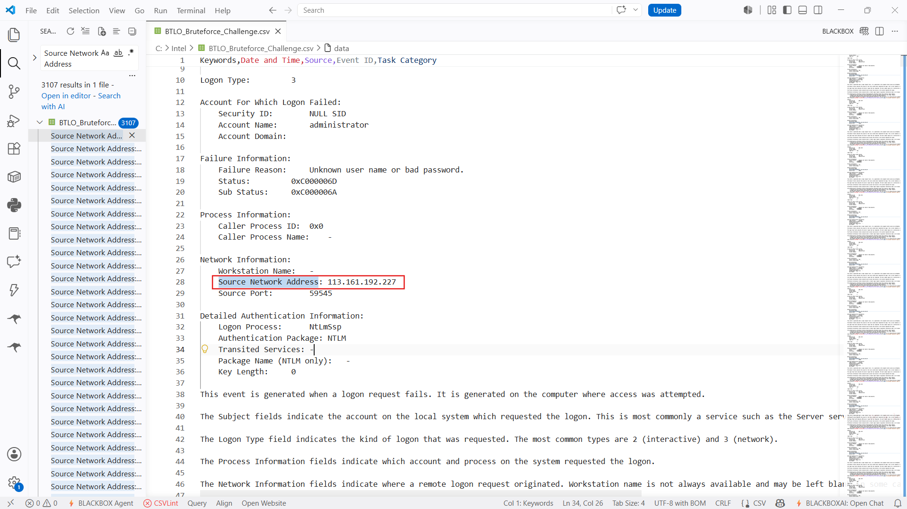

---

# Bruteforce Investigation

## Overview

The Bruteforce Investigation Lab focuses on analyzing Windows Security Event Logs generated during a Remote Desktop Protocol (RDP) brute-force attack.

During the investigation, Windows Security Audit Failure events were analyzed to identify the attacker, determine the targeted account, examine authentication failures, and extract valuable Indicators of Compromise (IOCs).

The primary objective was to reconstruct the attack activity using Windows Event Logs, identify the attacking infrastructure, and map the observed behavior to the MITRE ATT&CK Framework.

---

# Scenario

A Windows server generated thousands of Security Audit Failure events indicating repeated failed authentication attempts.

System administrators suspected an automated brute-force attack targeting Remote Desktop services (RDP). The investigation focused on identifying:

* The targeted account
* The attacker's source IP
* Authentication failure details
* Source port behavior
* Geographic attribution
* Relevant MITRE ATT&CK techniques

---

# Investigation Process

---

## Stage 1 – Windows Security Log Analysis

The investigation began by analyzing the exported Windows Security Event Logs.

The logs contained thousands of **Audit Failure** events corresponding to Windows Event ID **4625**, indicating repeated failed logon attempts.

Each event was inspected to identify the authentication information, failure reason, account details, source IP address, and network information.

### Evidence

*(Insert screenshot showing Event ID 4625 entries)*

---

## Stage 2 – Target Account Identification

Analysis of the **Account For Which Logon Failed** section revealed that the attacker repeatedly attempted to authenticate against the local Windows account:

**administrator**

This strongly suggested an automated dictionary or password brute-force attack against the default administrative account.

### Evidence

---

## Stage 3 – Authentication Failure Analysis

The Failure Information section showed the same failure reason across every authentication attempt:

> Unknown user name or bad password.

The repeated occurrence of this message confirmed unsuccessful password guessing attempts.

### Evidence

*(Insert screenshot showing Failure Reason)*

---

## Stage 4 – Source IP Investigation

The Network Information section revealed the attacker IP:

**113.161.192.227**

The IP address was investigated using public threat intelligence sources to determine its geographical location.

The address was associated with:

**Vietnam**

This attribution provided additional context regarding the origin of the attack.

### Evidence

*(Insert screenshot showing Source Network Address)*

---

## Stage 5 – Source Port Analysis

Each authentication attempt originated from a different ephemeral source port.

Sorting every logged source port revealed the attacker utilized ports ranging from:

**49162–65534**

The continuously changing source ports indicate automated connection attempts rather than a legitimate user session.

### Evidence

*(Insert screenshot showing sorted source ports)*

---

## Stage 6 – Attack Pattern Analysis

Reviewing the timeline showed thousands of consecutive authentication failures occurring within a short period.

The attacker continuously attempted to authenticate against the same account without successful logon events.

This behavior is characteristic of an automated RDP brute-force attack.

---

# Indicators of Compromise (IOCs)

| Type              | Value                             |
| ----------------- | --------------------------------- |
| Event ID          | 4625                              |
| Attack Type       | RDP Brute Force                   |
| Target Username   | administrator                     |
| Failure Reason    | Unknown user name or bad password |
| Source IP         | 113.161.192.227                   |
| Country           | Vietnam                           |
| Source Port Range | 49162-65534                       |

---

# MITRE ATT&CK Mapping

| Tactic            | Technique                        |
| ----------------- | -------------------------------- |
| Credential Access | T1110 – Brute Force              |
| Initial Access    | T1133 – External Remote Services |

---

# Key Findings

* Identified over 3,100 Windows Audit Failure events.
* Determined the attack targeted the local **administrator** account.
* Identified Windows Event ID **4625** as the primary event.
* Confirmed repeated authentication failures caused by incorrect credentials.
* Identified the attacker's source IP address.
* Attributed the IP address to **Vietnam**.
* Determined the attacker utilized a wide range of ephemeral source ports.
* Reconstructed the brute-force attack using Windows Security Event Logs.
* Mapped the observed activity to the MITRE ATT&CK Framework.

---

# Tools Used

* Windows Event Viewer
* Visual Studio Code
* PowerShell
* Windows Security Event Logs
* VirusTotal (IP Reputation)
* IP Geolocation Lookup

---

# Skills Demonstrated

* Windows Event Log Analysis
* Security Log Investigation
* Authentication Analysis
* Incident Response
* IOC Extraction
* Threat Hunting
* PowerShell
* Windows Security Auditing
* MITRE ATT&CK Mapping
* Brute Force Detection

---

