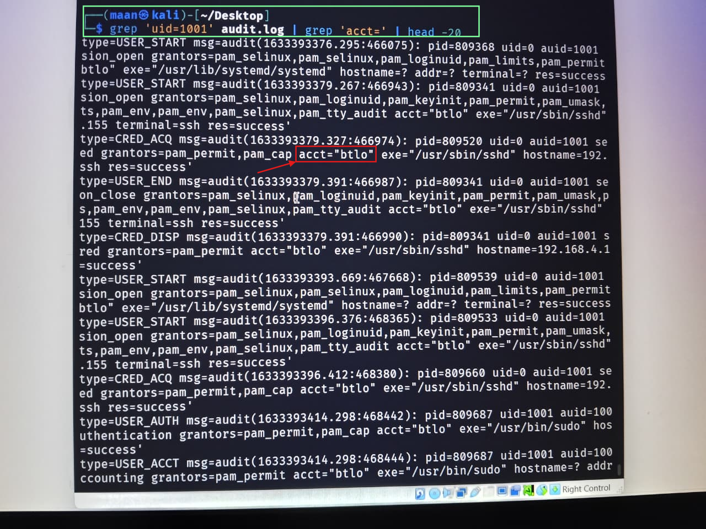
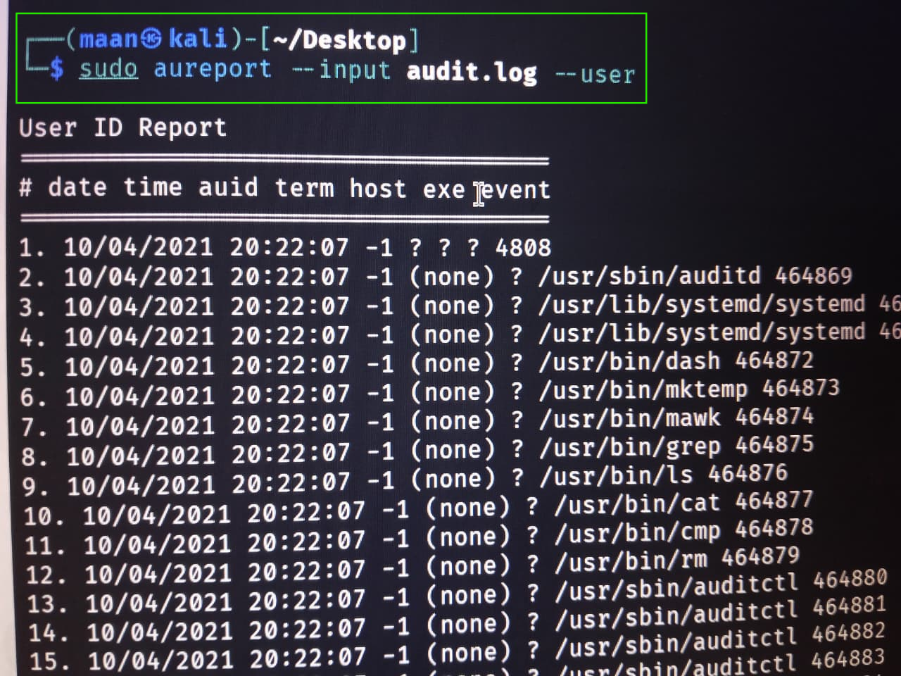
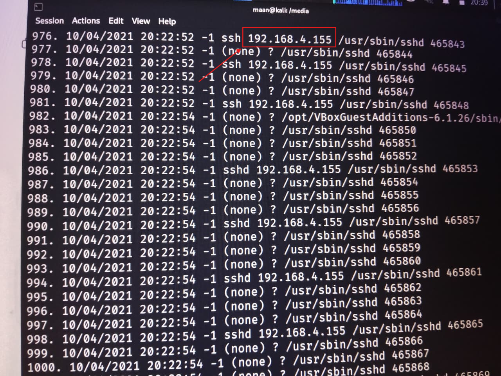
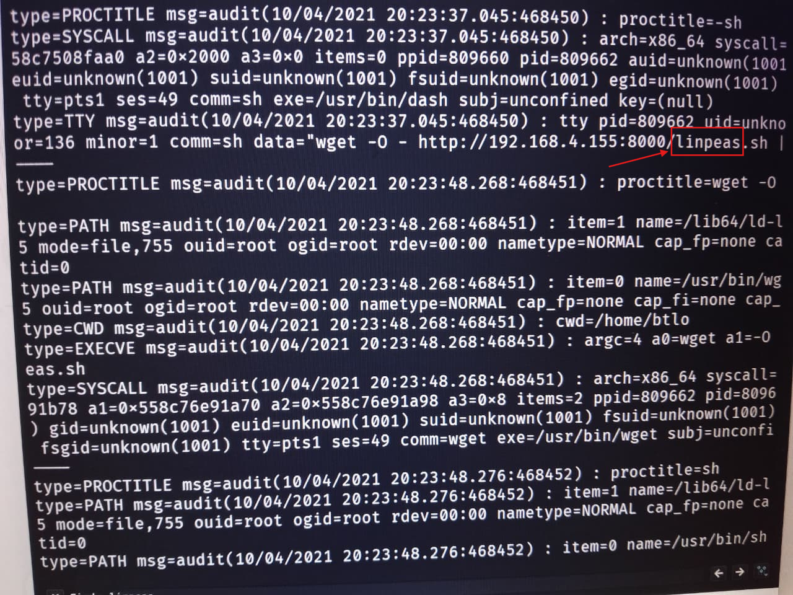
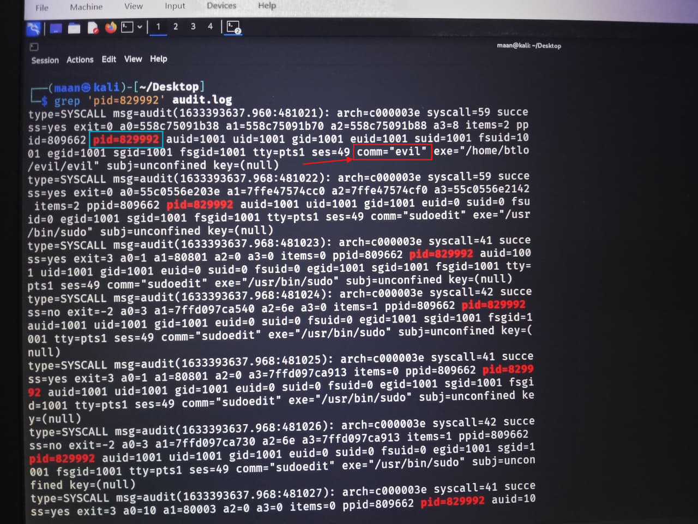
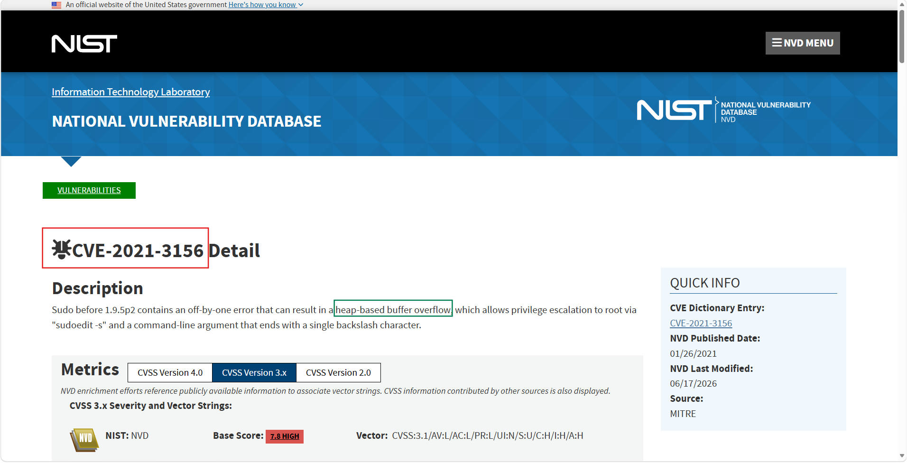

---

# Linux Privilege Escalation Investigation


## Overview

The Linux Privilege Escalation Investigation focused on analyzing Linux audit logs to reconstruct an attacker’s activity from initial compromise through privilege escalation and post-exploitation actions.

During the investigation, Linux auditd logs were analyzed to identify the compromised account, determine the attack vector, trace privilege escalation, identify the exploited vulnerability, and reconstruct the attack timeline.

The primary objective was to investigate how the attacker obtained root access, identify Indicators of Compromise (IOCs), and map the observed behavior to the MITRE ATT&CK Framework.

---

# Scenario

A Linux server was suspected of being compromised after unusual privileged activity was detected.

Using the provided Linux audit logs, the investigation focused on identifying:

* The compromised account
* Initial access method
* Attacker IP address
* Enumeration tools used
* Privilege escalation technique
* Exploited vulnerability
* Exfiltrated data
* MITRE ATT&CK techniques

---

# Investigation Process

## Stage 1 – Compromised Account Identification

The Linux audit logs were analyzed to determine which user account had been compromised.

Authentication records confirmed that the attacker successfully authenticated using the account:

**btlo**

Evidence



---

## Stage 2 – Initial Access Analysis

Reviewing the authentication events revealed multiple failed login attempts before a successful authentication.

This activity indicated a classic:

**Brute Force Attack**

used to gain initial access.

---

## Stage 3 – Attacker Identification

Network-related audit records identified the attacker's source IP address.

The investigation determined the attacker originated from:

**192.168.4.155**

Evidence


---

## Stage 4 – System Enumeration

After obtaining access, the attacker performed local system enumeration.

Analysis of executed binaries revealed the use of:

**linPEAS**

which is commonly used to enumerate privilege escalation opportunities on Linux systems.

Evidence


---

## Stage 5 – Privilege Escalation Analysis

Process execution logs (auditd syscall records) revealed execution of a custom binary named:

**evil**

Process ID:

**829992**

Immediately afterward, the process executed **sudo**, gained **EUID=0**, and spawned a root shell.

This confirmed that the binary responsible for obtaining root privileges was:

**evil (PID 829992)**

Evidence


---

## Stage 6 – Vulnerability Identification

Further analysis of the privilege escalation technique showed that the attacker exploited:

**CVE-2021-3156**

also known as **Baron Samedit**.

This vulnerability affects the Linux **sudo** utility and allows local users to escalate privileges to root.

Evidence


---

## Stage 7 – Vulnerability Classification

Research into CVE-2021-3156 identified the underlying vulnerability as:

**Heap-Based Buffer Overflow**

The flaw allows attackers to overwrite heap memory and achieve arbitrary code execution with elevated privileges.

Evidence


---

## Stage 8 – Data Exfiltration

TTY audit records showed the attacker executing:

```bash
cat /etc/shadow
```

This confirmed that the attacker exfiltrated the Linux password hash database:

**/etc/shadow**

Evidence

*(Screenshot)*

---

# Indicators of Compromise (IOCs)

| Type                | Value                      |
| ------------------- | -------------------------- |
| Compromised Account | btlo                       |
| Attack Type         | Brute Force                |
| Attacker IP         | 192.168.4.155              |
| Enumeration Tool    | linPEAS                    |
| Malicious Binary    | evil                       |
| Process ID          | 829992                     |
| Exploited CVE       | CVE-2021-3156              |
| Vulnerability Type  | Heap-Based Buffer Overflow |
| Exfiltrated File    | /etc/shadow                |

---

# MITRE ATT&CK Mapping

| Tactic               | Technique                                        |
| -------------------- | ------------------------------------------------ |
| Initial Access       | T1110 – Brute Force                              |
| Discovery            | T1082 – System Information Discovery             |
| Privilege Escalation | T1068 – Exploitation for Privilege Escalation    |
| Credential Access    | T1003.008 – OS Credential Dumping: `/etc/shadow` |
| Collection           | T1005 – Data from Local System                   |

---

# Key Findings

* Identified the compromised Linux account (**btlo**).
* Confirmed the attacker gained initial access through a brute-force attack.
* Identified the attacker's IP address (**192.168.4.155**).
* Determined that **linPEAS** was used for system enumeration.
* Identified the malicious binary (**evil**) responsible for privilege escalation.
* Confirmed the process ID associated with the attack (**829992**).
* Determined that the attacker exploited **CVE-2021-3156 (Baron Samedit)**.
* Classified the vulnerability as a **Heap-Based Buffer Overflow**.
* Confirmed successful privilege escalation to root.
* Identified the exfiltration of the **/etc/shadow** file.
* Reconstructed the complete attack chain using Linux audit logs.
* Mapped the attack techniques to the MITRE ATT&CK Framework.

---

# Tools Used

* Linux auditd
* audit.log
* grep
* awk
* sed
* xxd
* Linux Terminal
* Visual Studio Code
* CVE Research
* MITRE ATT&CK Framework

---

# Skills Demonstrated

* Linux Forensics
* Linux Audit Log Analysis
* Incident Response
* Privilege Escalation Investigation
* Threat Hunting
* IOC Extraction
* Process Analysis
* CVE Research
* Linux Security
* MITRE ATT&CK Mapping
* Digital Forensics
* Timeline Reconstruction
