---

# Phishing Investigation: Wallet Verification Scam
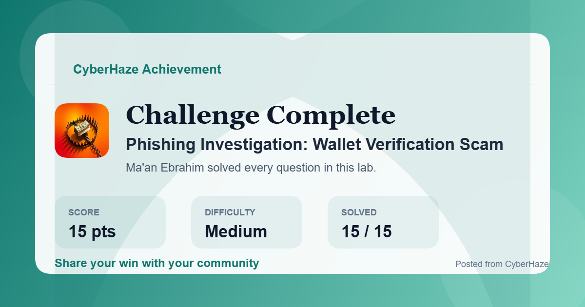
## Overview

The **Phishing Investigation: Wallet Verification Scam** lab simulates a real-world phishing email investigation conducted from the perspective of a Security Operations Center (SOC) analyst. The objective of the investigation is to determine whether a suspicious email reported by a user represents a legitimate communication or a credential harvesting phishing campaign.

Throughout the investigation, multiple email forensic techniques were applied, including email header analysis, sender verification, SMTP path reconstruction, authentication validation (SPF, DKIM, and DMARC), IP reputation analysis, WHOIS investigation, DNS record analysis, and embedded hyperlink inspection.

The investigation also incorporates Open-Source Intelligence (OSINT) to validate the sender's infrastructure and identify Indicators of Compromise (IOCs). Finally, the collected evidence is correlated with the MITRE ATT&CK Framework to understand the attacker's techniques and provide actionable detection opportunities.

---

# Scenario

An internal user reported receiving an email claiming that their **Trust Wallet** account would be permanently suspended unless immediate verification was completed.

The email instructed the recipient to click a **"Confirm my wallet"** button to verify their wallet and avoid account suspension.

Because the message created a strong sense of urgency while requesting user interaction, the SOC team initiated a phishing investigation to determine whether the email originated from the legitimate Trust Wallet service or from a malicious actor attempting to harvest user credentials.

The investigation focused on reconstructing the email delivery path, validating sender authentication, analyzing the sender's infrastructure, investigating embedded hyperlinks, and identifying phishing indicators throughout the email.

---

# Investigation Process

## Stage 1 – Email Header Analysis

The investigation began by examining the suspicious email within Microsoft Outlook before performing a detailed analysis of the raw SMTP headers.

The initial review immediately revealed several suspicious characteristics. The subject line attempted to pressure the recipient by claiming that all unverified wallet accounts would soon be suspended, a common social engineering tactic used to create urgency and encourage immediate action.

The displayed sender appeared as **Trustwallet-Support**, giving the impression that the message originated from the legitimate Trust Wallet support team. However, the underlying sender address belonged to the **emails.gorgias.com** domain rather than an official Trust Wallet domain.

Further examination of the complete email header exposed the actual Return-Path, the sender infrastructure, and the SMTP relay chain used to deliver the email. These artifacts provide significantly more reliable attribution than the visible sender information displayed within the email client.

The originating SMTP server IP address was identified as **143.55.227.147**, which became the primary indicator for further infrastructure investigation.

### Evidence

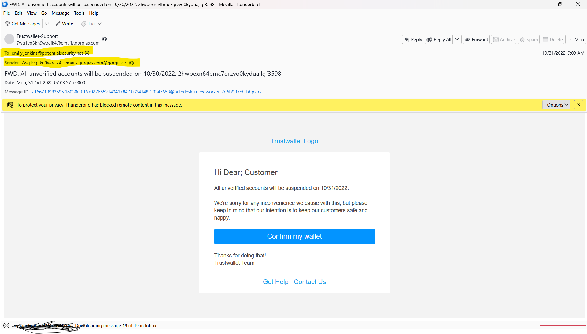
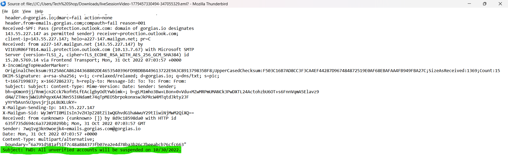
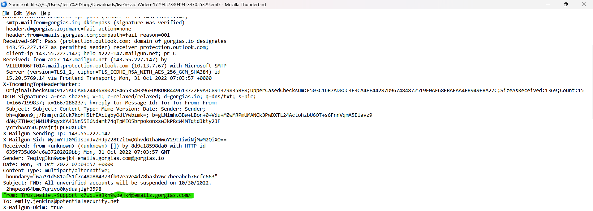
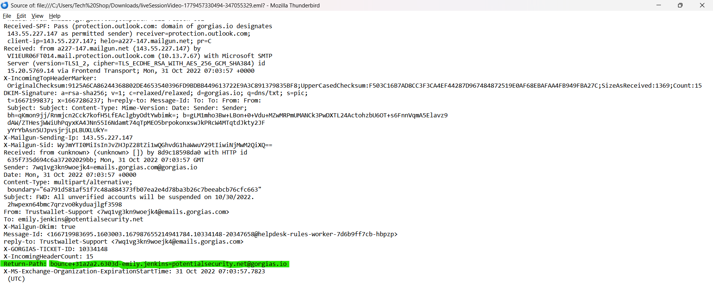
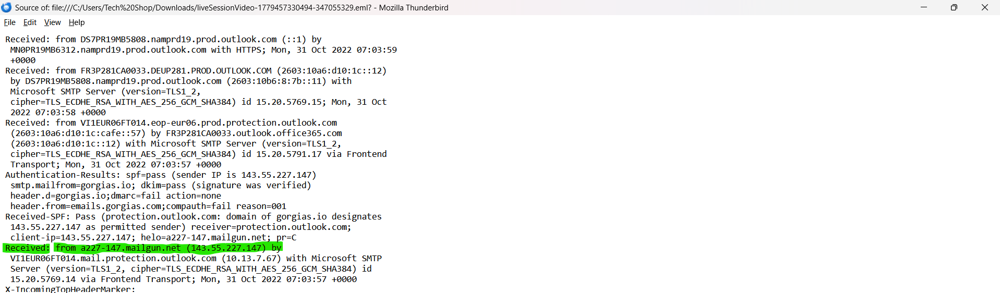
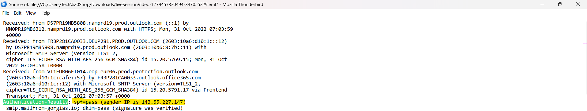
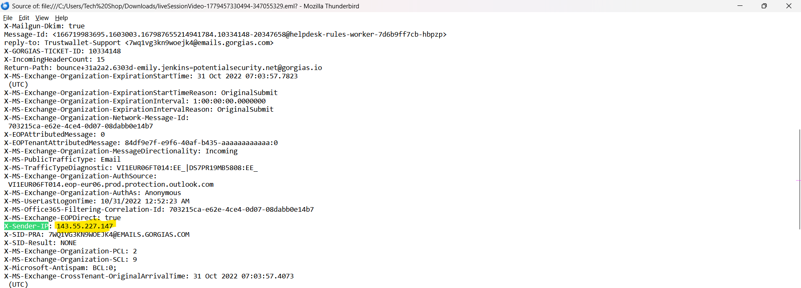

---

## Stage 2 – Email Authentication Analysis

After identifying the sender infrastructure, the next step was validating the email authentication mechanisms responsible for protecting against spoofed emails.

The **Authentication-Results** header revealed the outcome of the three major email authentication standards:

* Sender Policy Framework (SPF)
* DomainKeys Identified Mail (DKIM)
* Domain-based Message Authentication, Reporting and Conformance (DMARC)

The investigation produced the following results:

| Authentication | Result |
| -------------- | ------ |
| SPF            | PASS   |
| DKIM           | PASS   |
| DMARC          | FAIL   |

Both SPF and DKIM validation succeeded, indicating that the email originated from a server authorized to send emails on behalf of **gorgias.io**.

However, DMARC validation failed because the authenticated sending domain did not align with the visible **From** address shown to the recipient.

Although SPF and DKIM individually passed, the domain alignment failure caused DMARC to reject the message as unauthenticated. This technique is frequently observed when attackers abuse legitimate third-party mailing platforms to deliver phishing emails.

### Evidence

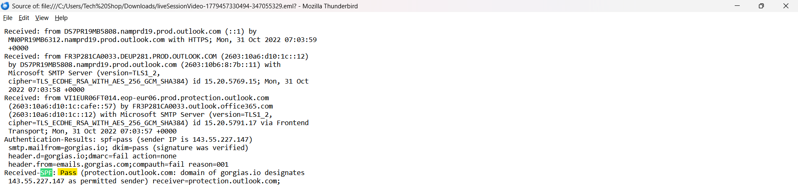
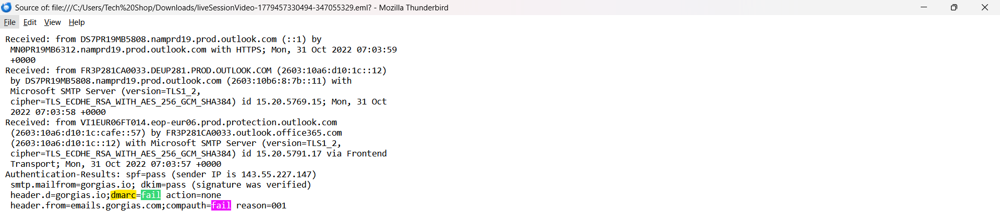
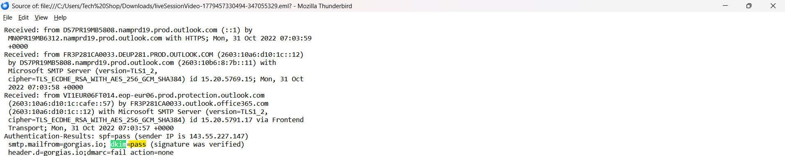

---

## Stage 3 – Infrastructure Investigation

To better understand the sender infrastructure, the originating IP address extracted from the email header was investigated using publicly available threat intelligence and IP reputation services.

The originating IP address:

```
143.55.227.147
```

OSINT analysis identified the IP as belonging to **Mailgun Technologies Inc.**, a cloud-based email delivery platform commonly used by organizations to send transactional emails.

Additional investigation confirmed that the IP geolocation resolved to the **United States** and belonged to **ASN 396479**.

The sender domain **gorgias.io** was then investigated using WHOIS and DNS records.

WHOIS analysis revealed that the domain was registered on **2014/11/20** and remains active until **2030/11/20**, indicating that the phishing campaign abused an established and reputable email platform rather than a recently registered domain.

DNS enumeration further revealed the following MX record:

```
aspmx.l.google.com
```

This confirms that the domain relies on Google's mail infrastructure for receiving email.

The investigation demonstrates that legitimate cloud email providers can be abused to distribute phishing campaigns while still successfully passing certain authentication checks.

### Evidence

**Screenshot 4**

IPinfo

Highlight:

* IP Address
* Country
* ASN
* Mailgun Technologies Inc.

---

**Screenshot 5**

WHOIS

Highlight:

* Registered On
* Expiration Date

---

**Screenshot 6**

MX Lookup

Highlight:

* aspmx.l.google.com
