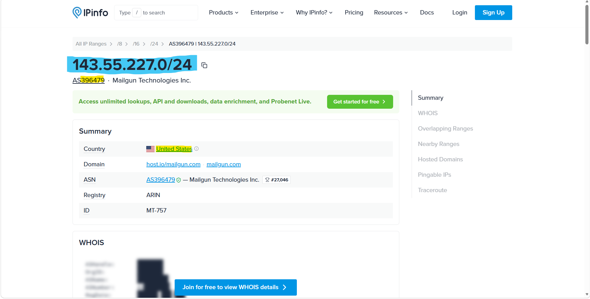
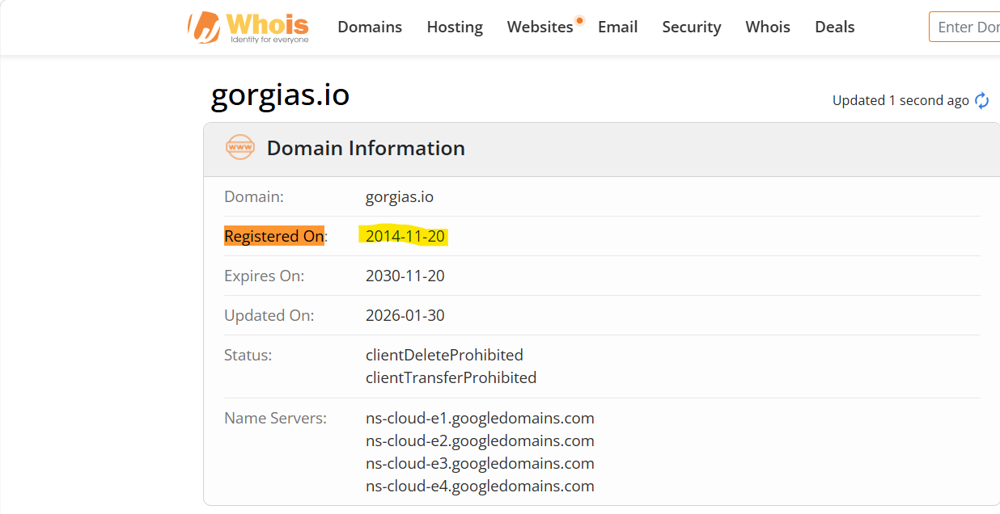
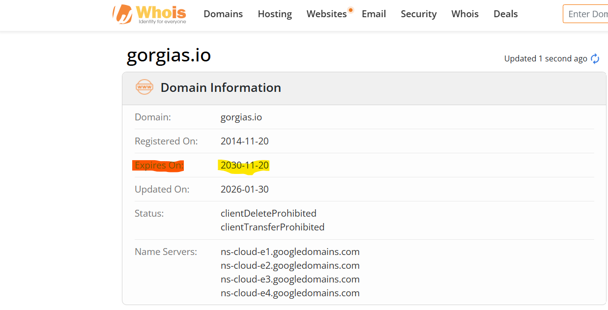
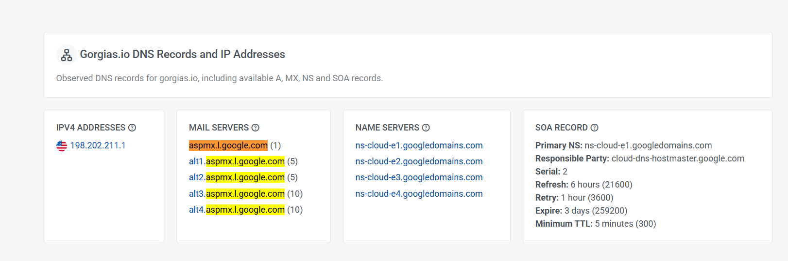
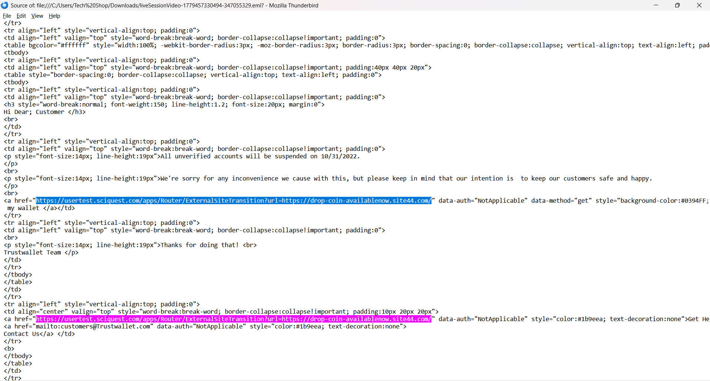

---

# Phishing Investigation: Wallet Verification Scam

## Overview

The **Phishing Investigation: Wallet Verification Scam** lab simulates a real-world phishing email investigation conducted from the perspective of a Security Operations Center (SOC) analyst. The objective of the investigation is to determine whether a suspicious email reported by a user represents a legitimate communication or a credential harvesting phishing campaign.

Throughout the investigation, multiple email forensic techniques were applied, including email header analysis, sender verification, SMTP path reconstruction, authentication validation (SPF, DKIM, and DMARC), IP reputation analysis, WHOIS investigation, DNS record analysis, and embedded hyperlink inspection.

The investigation also incorporates Open-Source Intelligence (OSINT) to validate the sender's infrastructure and identify Indicators of Compromise (IOCs). Finally, the collected evidence is correlated with the MITRE ATT&CK Framework to understand the attacker's techniques and provide actionable detection opportunities.

---

# Scenario

An internal user reported receiving an email claiming that their **Trust Wallet** account would be permanently suspended unless immediate verification was completed.

The email instructed the recipient to click a **"Confirm my wallet"** button to verify their wallet and avoid account suspension.

Because the message created a strong sense of urgency while requesting user interaction, the SOC team initiated a phishing investigation to determine whether the email originated from the legitimate Trust Wallet service or from a malicious actor attempting to harvest user credentials.

The investigation focused on reconstructing the email delivery path, validating sender authentication, analyzing the sender's infrastructure, investigating embedded hyperlinks, and identifying phishing indicators throughout the email.

---

# Investigation Process

## Stage 1 – Email Header Analysis

The investigation began by examining the suspicious email within Microsoft Outlook before performing a detailed analysis of the raw SMTP headers.

The initial review immediately revealed several suspicious characteristics. The subject line attempted to pressure the recipient by claiming that all unverified wallet accounts would soon be suspended, a common social engineering tactic used to create urgency and encourage immediate action.

The displayed sender appeared as **Trustwallet-Support**, giving the impression that the message originated from the legitimate Trust Wallet support team. However, the underlying sender address belonged to the **emails.gorgias.com** domain rather than an official Trust Wallet domain.

Further examination of the complete email header exposed the actual Return-Path, the sender infrastructure, and the SMTP relay chain used to deliver the email. These artifacts provide significantly more reliable attribution than the visible sender information displayed within the email client.

The originating SMTP server IP address was identified as **143.55.227.147**, which became the primary indicator for further infrastructure investigation.

### Evidence


---

## Stage 2 – Email Authentication Analysis

After identifying the sender infrastructure, the next step was validating the email authentication mechanisms responsible for protecting against spoofed emails.

The **Authentication-Results** header revealed the outcome of the three major email authentication standards:

* Sender Policy Framework (SPF)
* DomainKeys Identified Mail (DKIM)
* Domain-based Message Authentication, Reporting and Conformance (DMARC)

The investigation produced the following results:

| Authentication | Result |
| -------------- | ------ |
| SPF            | PASS   |
| DKIM           | PASS   |
| DMARC          | FAIL   |

Both SPF and DKIM validation succeeded, indicating that the email originated from a server authorized to send emails on behalf of **gorgias.io**.

However, DMARC validation failed because the authenticated sending domain did not align with the visible **From** address shown to the recipient.

Although SPF and DKIM individually passed, the domain alignment failure caused DMARC to reject the message as unauthenticated. This technique is frequently observed when attackers abuse legitimate third-party mailing platforms to deliver phishing emails.

### Evidence


---

## Stage 3 – Infrastructure Investigation

To better understand the sender infrastructure, the originating IP address extracted from the email header was investigated using publicly available threat intelligence and IP reputation services.

The originating IP address:

```
143.55.227.147
```

OSINT analysis identified the IP as belonging to **Mailgun Technologies Inc.**, a cloud-based email delivery platform commonly used by organizations to send transactional emails.

Additional investigation confirmed that the IP geolocation resolved to the **United States** and belonged to **ASN 396479**.

The sender domain **gorgias.io** was then investigated using WHOIS and DNS records.

WHOIS analysis revealed that the domain was registered on **2014/11/20** and remains active until **2030/11/20**, indicating that the phishing campaign abused an established and reputable email platform rather than a recently registered domain.

DNS enumeration further revealed the following MX record:

```
aspmx.l.google.com
```

This confirms that the domain relies on Google's mail infrastructure for receiving email.

The investigation demonstrates that legitimate cloud email providers can be abused to distribute phishing campaigns while still successfully passing certain authentication checks.

### Evidence





---

# Stage 4 – Email Content Analysis

After validating the sender infrastructure, the investigation shifted to the email body to identify social engineering techniques and phishing indicators.

At first glance, the email appears to be an official notification from **Trust Wallet Support**. The attacker copied the visual style of a legitimate service by including a wallet logo, professional formatting, and a support-style signature. These elements are intended to increase the recipient's confidence and reduce suspicion.

However, closer inspection immediately reveals multiple phishing indicators.

The greeting uses the generic phrase:

> **"Hi Dear Customer"**

instead of addressing the recipient by name. Legitimate financial services typically personalize security notifications using the customer's registered information.

The email also attempts to create urgency by warning that all unverified accounts will be suspended on **October 31, 2022**, encouraging the victim to act immediately without carefully evaluating the message.

Instead of explaining why verification is required, the email simply instructs the recipient to click a button labeled **"Confirm my wallet."** This type of direct call-to-action is one of the most common characteristics of credential harvesting campaigns.

Several additional phishing indicators were identified:

* Generic greeting instead of the recipient's name.
* Artificial urgency regarding account suspension.
* Request to verify the wallet immediately.
* Minimal explanation of the verification process.
* Heavy reliance on branding to establish trust.

Although the email appears visually convincing, these behavioral indicators strongly suggest a phishing attempt.

---

# Stage 5 – Hyperlink Investigation

The most important element of the investigation was analyzing the hyperlink embedded within the **"Confirm my wallet"** button.

Rather than linking directly to a phishing website, the attacker employed an intermediate redirection service.

The embedded hyperlink was identified as:

```text
https://usertest.sciquest.com/apps/Router/ExternalSiteTransition?url=https://drop-coin-availablenow.site44.com/
```

At first glance, the URL appears to belong to **SciQuest**, a legitimate business platform. However, inspection of the query string reveals that the user is immediately redirected to:

```text
https://drop-coin-availablenow.site44.com/
```

This technique is commonly used to bypass email security filters by embedding the malicious destination inside a trusted domain.

Instead of directly exposing the phishing website, the attacker abuses a legitimate redirection mechanism to hide the final destination.

This redirection chain significantly increases the likelihood that users—and even automated security gateways—will trust the hyperlink.

The destination domain strongly indicates a credential harvesting campaign targeting cryptocurrency wallet users.

### Evidence

---

# Indicators of Compromise (IOCs)

| Type               | Value                                                                                                         |
| ------------------ | ------------------------------------------------------------------------------------------------------------- |
| Display Name       | Trustwallet-Support                                                                                           |
| Displayed Email    | [7wq1vg3kn9woejk4@emails.gorgias.com](mailto:7wq1vg3kn9woejk4@emails.gorgias.com)                             |
| Return-Path        | bounce+31a2a2.6303d-emily.jenkins=[potentialsecurity.net@gorgias.io](mailto:potentialsecurity.net@gorgias.io) |
| Sender Domain      | gorgias.io                                                                                                    |
| Sending IP         | 143.55.227.147                                                                                                |
| Country            | United States                                                                                                 |
| MX Record          | aspmx.l.google.com                                                                                            |
| Malicious Redirect | drop-coin-availablenow.site44.com                                                                             |
| Initial Redirect   | usertest.sciquest.com                                                                                         |
| SPF                | Pass                                                                                                          |
| DKIM               | Pass                                                                                                          |
| DMARC              | Fail                                                                                                          |

---

# MITRE ATT&CK Mapping

| Tactic            | Technique                                                                                                     |
| ----------------- | ------------------------------------------------------------------------------------------------------------- |
| Initial Access    | Phishing (T1566)                                                                                              |
| Initial Access    | Spearphishing Link (T1566.002)                                                                                |
| Defense Evasion   | Trusted Relationship (T1199)                                                                                  |
| Credential Access | Steal or Forge Authentication Credentials (T1649)                                                             |
| Credential Access | Input Capture: Credential API Hooking / Credential Harvesting (T1056 - General Credential Collection Concept) |

---

# Key Findings

* Investigated a phishing email impersonating **Trust Wallet Support**.
* Identified multiple social engineering techniques designed to pressure the recipient into immediate action.
* Verified that the displayed sender differed from the actual sender infrastructure.
* Extracted the true Return-Path and originating SMTP IP address.
* Confirmed that the email originated from Mailgun infrastructure.
* Validated SPF and DKIM authentication as **Pass**.
* Determined that DMARC authentication **Failed** due to domain alignment issues.
* Performed OSINT analysis on the sender IP and domain.
* Investigated WHOIS and DNS MX records for the sender domain.
* Identified a malicious redirection chain embedded within the "Confirm my wallet" button.
* Confirmed that the phishing email attempted to redirect victims to a credential harvesting website.
* Collected multiple Indicators of Compromise (IOCs) suitable for future detection and threat hunting.

---

# Tools Used

* Microsoft Outlook
* Thunderbird (Email Analysis)
* IPinfo
* WHOIS Lookup
* MXToolbox
* DNS Lookup
* Microsoft Message Header Analyzer
* OSINT Resources

---

# Skills Demonstrated

* Email Header Analysis
* SMTP Analysis
* Email Authentication Analysis
* SPF Investigation
* DKIM Validation
* DMARC Analysis
* Phishing Detection
* Email Forensics
* OSINT Investigation
* WHOIS Analysis
* DNS Enumeration
* Hyperlink Analysis
* IOC Identification
* MITRE ATT&CK Mapping
* Incident Response
* Threat Hunting

---

# Conclusion

This investigation demonstrated how email forensics and open-source intelligence can be combined to identify sophisticated phishing attempts.

The investigation began with a detailed examination of the email headers, revealing discrepancies between the displayed sender information and the underlying SMTP infrastructure. Authentication analysis showed that while SPF and DKIM validation succeeded, DMARC failed because of domain alignment issues, highlighting a common technique used by attackers who abuse legitimate email delivery services.

Further infrastructure analysis confirmed that the message originated from Mailgun's cloud email platform, while WHOIS and DNS investigations provided additional context regarding the sender's domain. Examination of the email body revealed multiple social engineering techniques, including generic greetings, artificial urgency, and trusted branding designed to persuade the recipient to verify their cryptocurrency wallet.

Finally, hyperlink analysis exposed a multi-stage redirection chain that concealed the actual phishing destination behind a trusted intermediary URL, ultimately leading users toward a credential harvesting website.

By combining email header analysis, authentication validation, OSINT, DNS investigation, hyperlink inspection, and threat intelligence, the complete phishing campaign was successfully reconstructed. The collected Indicators of Compromise and observed attacker techniques provide valuable intelligence for future detection, threat hunting, and incident response activities.


Highlight:

* aspmx.l.google.com
