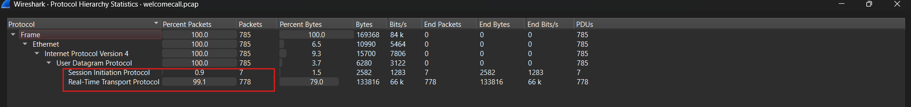

# Welcome Call – Network Forensics (VoIP / RTP Analysis)

**SunshineCTF 2026 · Forensics / Misc**

---

## Overview

This challenge provided a packet capture containing a VoIP call. The objective was to reconstruct the call, extract the audio stream, and recover a spoken flag hidden inside the RTP payload.

The investigation combined network forensics, VoIP protocol analysis (SIP/SDP/RTP), and audio processing to recover the final flag.

---

## Scenario

A PCAP file (`welcomecall.pcap`) was provided with the following description:

> Welcome to BSides Orlando! I just got a call from the flag factory, they said they were looking for their favorite CTFer?

The capture contained a completed SIP call between two hosts, followed by a one-way RTP audio stream. The spoken content was not intelligible when played normally, indicating that additional audio processing was required.

---

## Investigation Process

### Stage 1 – Protocol Identification

The PCAP was opened in Wireshark and examined using Protocol Hierarchy Statistics.

All traffic was UDP-based and consisted of:

| Protocol | Packets | Notes |
|----------|---------|-------|
| SIP      | 7       | Call signaling |
| RTP      | 778     | Audio stream |

No TCP traffic was present. The entire conversation occurred between:

- `192.0.2.10`
- `192.0.2.20`

**Evidence:**  


---

### Stage 2 – SIP Call Reconstruction

Using **Telephony → VoIP Calls**, a single completed SIP call was identified:

| Field | Value |
|-------|-------|
| From | `"Anonymous" <sip:anon@192.0.2.10>` |
| To | `"Board" <sip:board@192.0.2.20>` |
| State | COMPLETED |
| Duration | ~16 seconds |
| Method | INVITE → 200 OK → ACK → BYE |

The SDP negotiation showed:

- Media type: **audio**
- Codec: **G.711 PCMU (μ-law)**
- RTP port: **4000 → 4002**

**Evidence:**  
→ Screenshot of VoIP Calls window  
→ Screenshot of SIP INVITE / 200 OK packets

---

### Stage 3 – RTP Stream Analysis

The RTP stream was inspected under **Telephony → RTP → RTP Streams**:

| Field | Value |
|-------|-------|
| Source | 192.0.2.10:4000 |
| Destination | 192.0.2.20:4002 |
| SSRC | 0x48271739 |
| Payload | g711U |
| Packets | 778 |
| Duration | ~15.5 s |
| Direction | One-way only |

The audio was exported and converted from μ-law to WAV for analysis.

**Evidence:**  
→ Screenshot of RTP Streams window  
→ Screenshot of UDP Conversations

---

### Stage 4 – Audio Analysis

When the extracted WAV was played, the speech was unintelligible.

The audio was then reversed using Audacity:

```
Effect → Reverse
```

After reversing, the spoken message became clear:

> Welcome to BSides Orlando.  
> The flag that you are looking for is  
> **{thankyouforplaying}**  
> left curly brackets … right curly brackets  
> all lowercase, no spaces.  
> Thank you and have a good one.

**Evidence:**  
→ Screenshot of Audacity before Reverse  
→ Screenshot of Audacity after Reverse  
→ (Optional) Waveform comparison

---

### Stage 5 – Flag Recovery

SunshineCTF 2026 uses the official flag format:

```
sun{stuffs}
```

Combining the spoken content with the required format produced the final flag:

```
sun{thankyouforplaying}
```

---

## Indicators of Compromise / Artifacts

| Type | Value |
|------|-------|
| Caller IP | 192.0.2.10 |
| Callee IP | 192.0.2.20 |
| SIP Port | 5060 |
| RTP Ports | 4000 → 4002 |
| Codec | G.711 PCMU (Payload Type 0) |
| SSRC | 0x48271739 |
| Call-ID | anon-48271@192.0.2.10 |
| Direction | One-way RTP (caller → callee) |

---

## Key Findings

* Identified a complete SIP call setup and teardown.
* Confirmed media negotiation via SDP (G.711 μ-law).
* Extracted a one-way RTP audio stream.
* Discovered that the spoken flag was intentionally reversed.
* Recovered the flag after audio reversal.
* Mapped the result to the official SunshineCTF flag format `sun{...}`.

---

## Tools Used

* Wireshark
* Audacity (Effect → Reverse)
* FFmpeg (optional – `ffmpeg -i audio.wav -af areverse reversed.wav`)

---

## Skills Demonstrated

* Network Forensics
* VoIP Analysis (SIP / SDP / RTP)
* Packet Capture Analysis
* Audio Stream Extraction
* Audio Forensics
* Protocol Hierarchy Analysis
* CTF Flag Recovery

---

## Flag

```
sun{thankyouforplaying}
```

