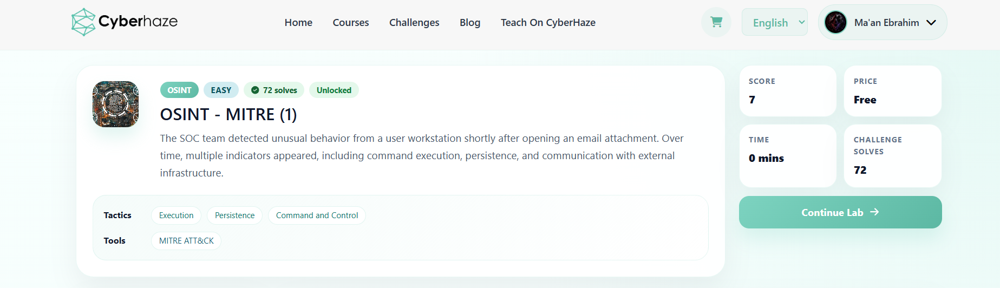
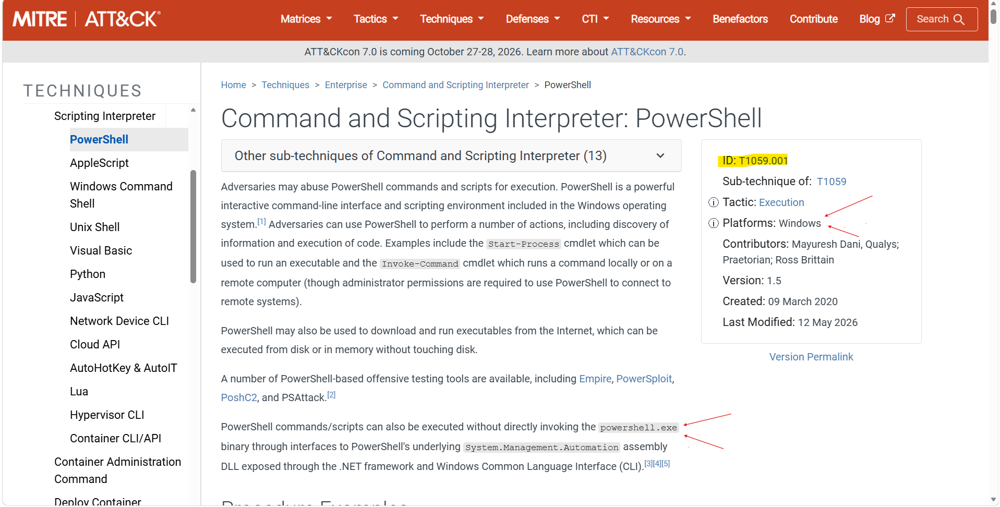
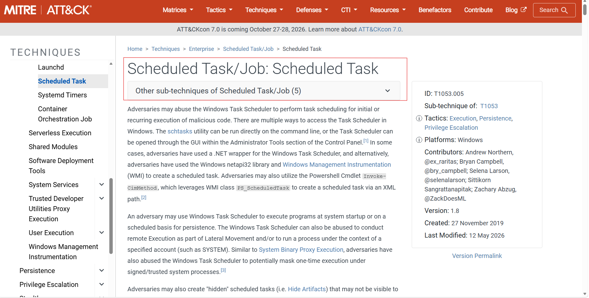
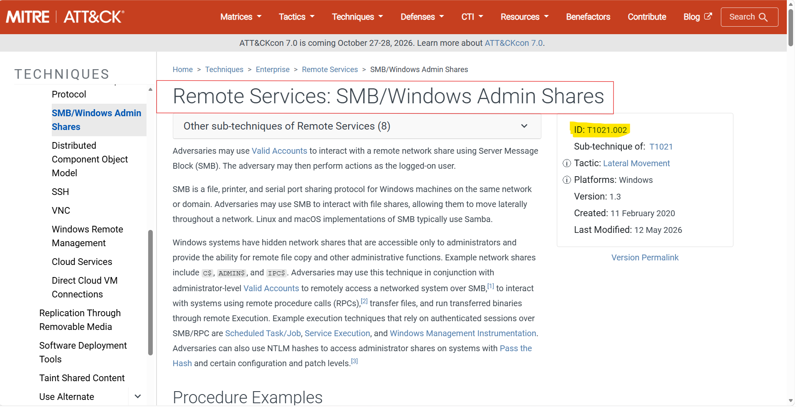
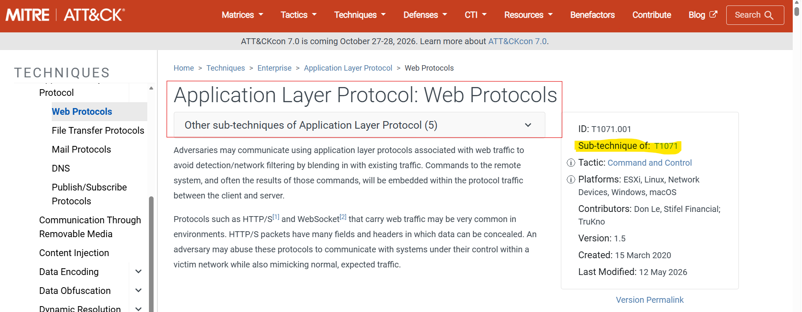
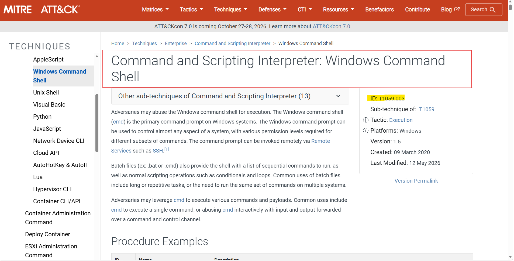

---

# OSINT Investigation - MITRE ATT&CK Mapping

## Overview

This lab focused on identifying and mapping attacker behavior to the MITRE ATT&CK Framework using Open-Source Intelligence (OSINT). Rather than analyzing malware samples or network captures, the investigation relied on interpreting attacker activities described within the scenario and identifying the corresponding MITRE ATT&CK techniques and sub-techniques.

The objective was to strengthen the ability to recognize attacker behavior, understand the relationship between different attack stages, and accurately classify each activity according to the MITRE ATT&CK Enterprise Matrix.

---

# Scenario

During routine monitoring, the SOC team identified suspicious activity originating from an internal workstation after a user interacted with a malicious email attachment. As the investigation progressed, multiple attacker behaviors were observed, including command execution, persistence, lateral movement, command-and-control communications, and defense evasion.

The task was to analyze each attacker action and determine the most appropriate MITRE ATT&CK Technique or Sub-technique representing the observed behavior.

---

# Investigation Process

---

## Stage 1 – Initial Access

The investigation began by identifying how the attacker initially compromised the victim system.

The scenario stated that the user opened an email attachment, resulting in the execution of malicious content. This behavior corresponds to spearphishing using a malicious attachment.

After reviewing the MITRE ATT&CK documentation, the activity was mapped to:

**Technique**

* **T1566.001 – Spearphishing Attachment**

---

## Stage 2 – Malicious Command Execution

Following the initial compromise, attacker-controlled commands were executed using PowerShell.

The scenario specifically referenced encoded commands executed through a native Windows scripting environment. This behavior aligns with PowerShell execution within the Command and Scripting Interpreter technique.

**Sub-technique**

* **T1059.001 – PowerShell**

---

## Stage 3 – Persistence

To maintain long-term access, the attacker configured a scheduled task that automatically executed malicious code at predefined intervals.

This recurring execution mechanism is commonly abused by adversaries to achieve persistence without requiring additional user interaction.

**Sub-technique**

* **T1053.005 – Scheduled Task**

### Evidence

---

## Stage 4 – Lateral Movement

Authentication logs indicated that the attacker successfully accessed another internal system by leveraging built-in Windows administrative functionality.

This activity represents authenticated lateral movement using Windows administrative shares.

**Sub-technique**

* **T1021.002 – SMB/Windows Admin Shares**

### Evidence

---

## Stage 5 – Command and Control

Network monitoring detected periodic outbound communications between the compromised host and an external IP address.

The attacker utilized standard application layer protocols to blend malicious traffic with legitimate network activity, making detection more difficult.

**Technique**

* **T1071 – Application Layer Protocol**

### Evidence

---

## Stage 6 – Command Execution Using Windows Command Shell

Additional investigation revealed that commands were executed through the native Windows Command Prompt instead of a scripting engine.

This activity corresponds to execution using the Windows Command Shell.

**Sub-technique**

* **T1059.003 – Windows Command Shell**

### Evidence

*(Insert MITRE ATT&CK screenshot here)*

---

## Stage 7 – Defense Evasion

The attacker attempted to hide malicious activity by modifying or removing artifacts generated during execution, reducing evidence available to defenders.

This behavior aligns with the MITRE ATT&CK technique for Indicator Removal.

**Technique**

* **T1070 – Indicator Removal**

### Evidence

*(Insert MITRE ATT&CK screenshot here)*

---

# MITRE ATT&CK Mapping

| Stage               | MITRE ID  | Technique                  |
| ------------------- | --------- | -------------------------- |
| Initial Access      | T1566.001 | Spearphishing Attachment   |
| Execution           | T1059.001 | PowerShell                 |
| Persistence         | T1053.005 | Scheduled Task             |
| Lateral Movement    | T1021.002 | SMB/Windows Admin Shares   |
| Command and Control | T1071     | Application Layer Protocol |
| Execution           | T1059.003 | Windows Command Shell      |
| Defense Evasion     | T1070     | Indicator Removal          |

---

# Key Findings

* Identified the initial attack vector as a malicious email attachment.
* Mapped PowerShell execution to the appropriate MITRE ATT&CK sub-technique.
* Identified Scheduled Tasks as the persistence mechanism.
* Determined that the attacker used SMB Administrative Shares for lateral movement.
* Identified Application Layer Protocols as the command-and-control communication method.
* Distinguished between PowerShell execution and Windows Command Shell execution.
* Identified the defense evasion technique used to remove indicators from the compromised host.
* Successfully mapped the complete attack chain using the MITRE ATT&CK Framework.

---

# Tools Used

* MITRE ATT&CK Enterprise
* Open Source Intelligence (OSINT)
* Web Browser

---

# Skills Demonstrated

* MITRE ATT&CK Mapping
* Threat Analysis
* Attack Classification
* Cyber Threat Intelligence
* Open Source Intelligence (OSINT)
* Adversary Behavior Analysis
* Tactic & Technique Identification
* Security Operations (SOC)
* Threat Hunting Fundamentals

---

# Conclusion

This lab demonstrated the practical application of the MITRE ATT&CK Framework for analyzing attacker behavior through OSINT. By examining each stage of the attack lifecycle, it was possible to accurately map malicious activities to their corresponding MITRE techniques and sub-techniques.

The exercise reinforced an understanding of attacker tactics including Initial Access, Execution, Persistence, Lateral Movement, Command and Control, and Defense Evasion. Developing the ability to classify adversary behavior using MITRE ATT&CK improves threat hunting, incident response, detection engineering, and communication within Security Operations Centers (SOC), providing a standardized methodology for describing and responding to cyber threats.
