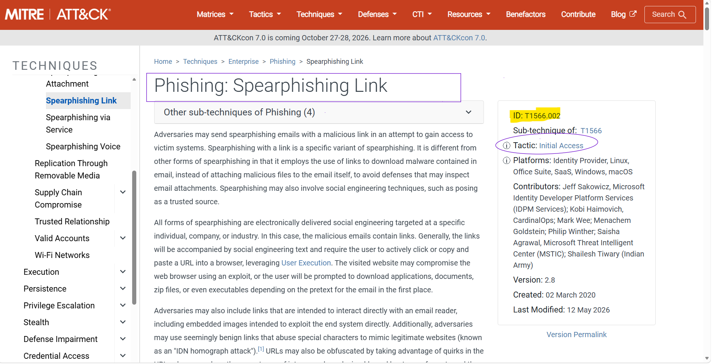
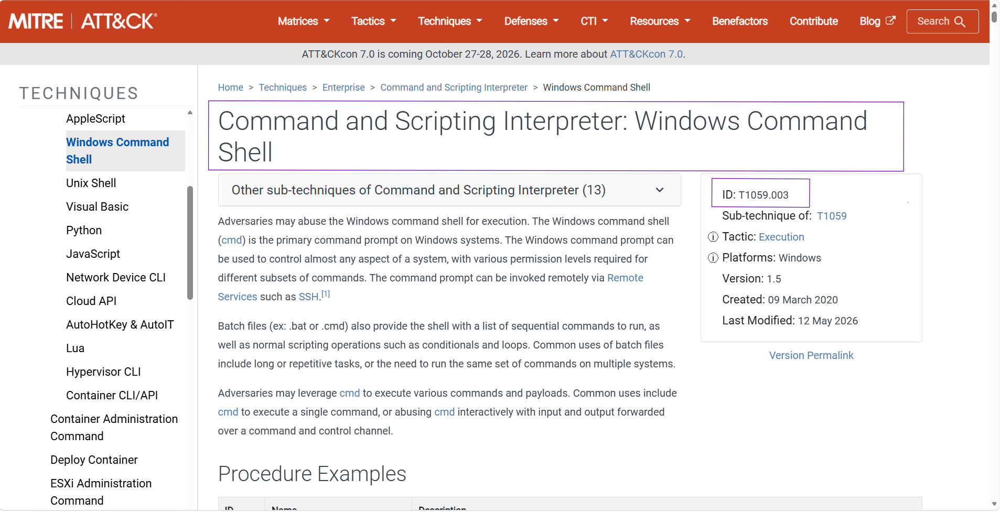
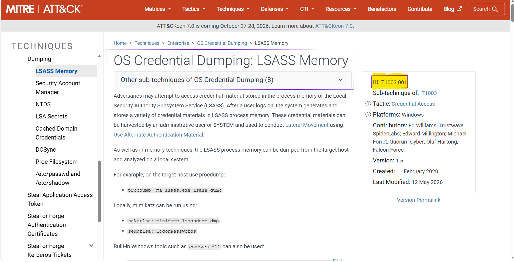
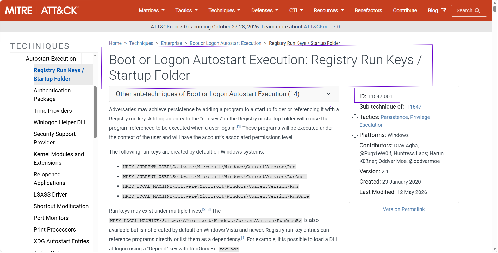
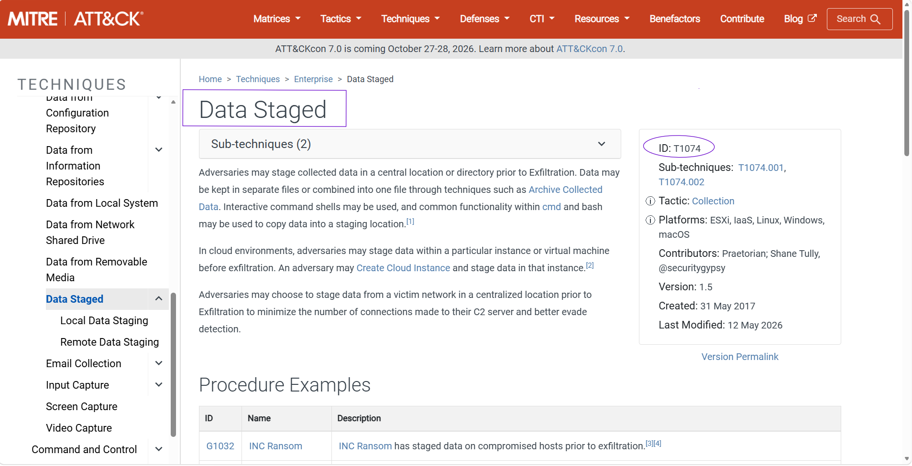
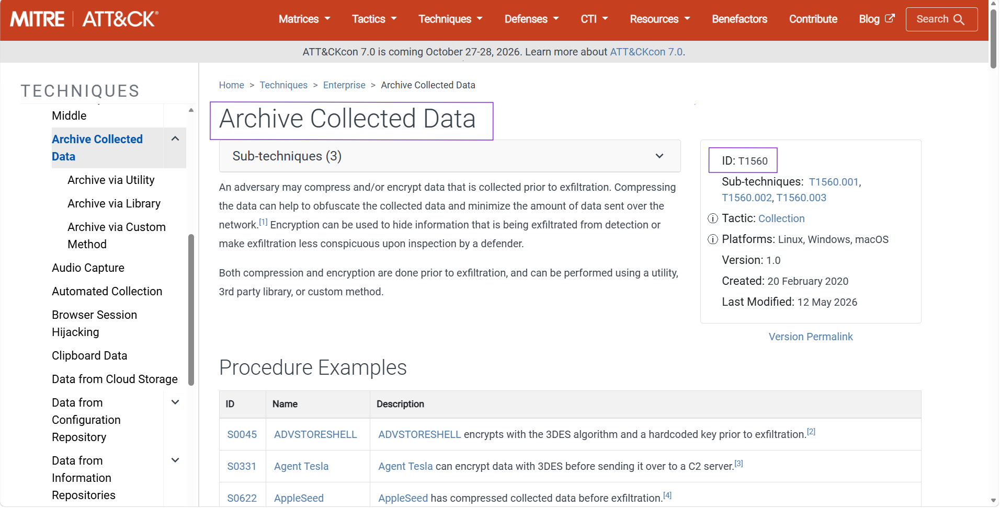
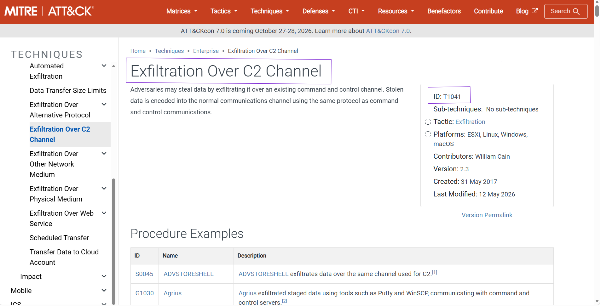
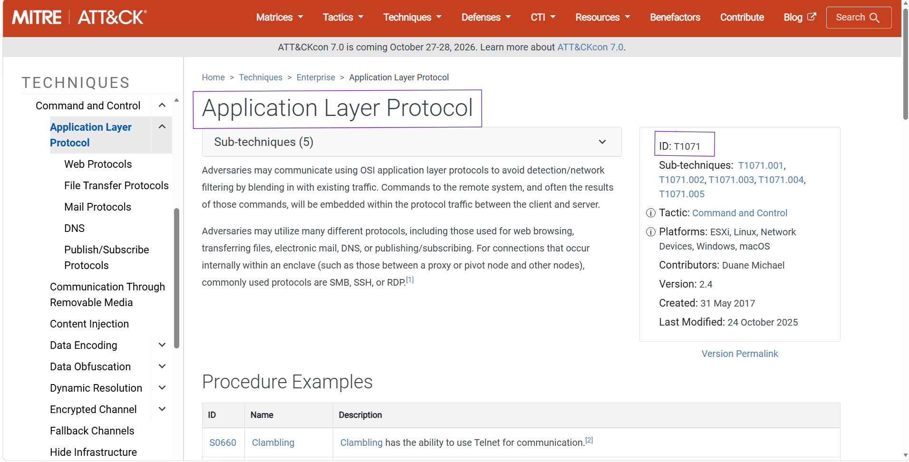
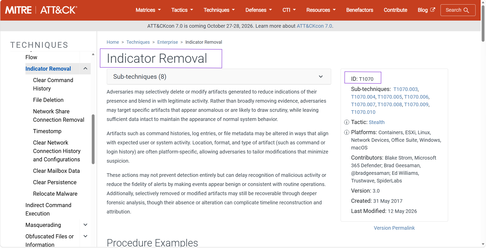

# OSINT Investigation (MITRE ATT&CK) – Case 02

## Overview

The **OSINT Investigation (MITRE ATT&CK) – Case 02** lab focuses on identifying attacker behaviors by analyzing a simulated intrusion scenario and mapping each observed activity to the appropriate **MITRE ATT&CK** technique.

Throughout the investigation, the attack chain was reconstructed from the initial phishing email through execution, credential access, persistence, command and control, data staging, archival, exfiltration, and defense evasion. Rather than performing malware analysis or packet analysis, the investigation relied on understanding attacker behavior and accurately classifying each action using the MITRE ATT&CK Framework.

The primary objective of this lab was to strengthen knowledge of MITRE ATT&CK techniques while improving the ability to identify adversary behaviors commonly encountered during SOC investigations and threat hunting.

---

# Scenario

An internal workstation exhibited suspicious behavior shortly after a user interacted with a phishing email containing a malicious link. The attacker executed commands on the compromised system, extracted credentials from Windows memory, established persistence, collected and archived sensitive files, communicated with external infrastructure, exfiltrated data, and attempted to hide evidence by tampering with system logs.

The investigation focused on analyzing each stage of the attack and mapping the observed behavior to the appropriate MITRE ATT&CK techniques and sub-techniques.

---

# Investigation Process

## Stage 1 – Initial Access

The investigation began by reviewing how the attacker gained access to the victim system.

Analysis showed that the compromise started after the victim clicked a malicious link delivered through a phishing email. Unlike phishing attachments, the attack relied on user interaction with a URL that redirected the victim to malicious content.

This behavior maps to the **Phishing: Spearphishing Link** sub-technique.

### MITRE ATT&CK

**Technique:** T1566.002 – Phishing: Spearphishing Link

### Evidence

---

## Stage 2 – Command Execution

After gaining access, the attacker executed commands using the native Windows Command Prompt.

The investigation determined that the attacker leveraged the built-in Windows Command Shell (cmd.exe) to execute system commands without introducing custom binaries.

This behavior maps to the Windows Command Shell sub-technique.

### MITRE ATT&CK

**Technique:** T1059.003 – Command and Scripting Interpreter: Windows Command Shell

### Evidence

---

## Stage 3 – Credential Access

Memory analysis revealed that sensitive authentication material was extracted directly from the Windows LSASS process.

Since LSASS stores user credentials, password hashes, and Kerberos tickets, attackers frequently dump its memory to obtain authentication material for privilege escalation or lateral movement.

This behavior maps to **LSASS Memory**.

### MITRE ATT&CK

**Technique:** T1003.001 – OS Credential Dumping: LSASS Memory

### Evidence

---

## Stage 4 – Persistence

To survive system reboots, the attacker modified Windows Registry Run Keys that automatically execute programs when a user logs on.

This technique allows malware to launch every time Windows starts without requiring further attacker interaction.

### MITRE ATT&CK

**Technique:** T1547.001 – Boot or Logon Autostart Execution: Registry Run Keys / Startup Folder

### Evidence

---

## Stage 5 – Data Staging

Before transmitting stolen information, the attacker collected files from multiple directories and staged them into a central location.

Staging data simplifies exfiltration by organizing collected files before they are transferred outside the environment.

### MITRE ATT&CK

**Technique:** T1074 – Data Staged

### Evidence

---

## Stage 6 – Archive Collected Data

After gathering the files, the attacker compressed them into an archive format to reduce size and improve transmission efficiency.

Archiving data before exfiltration is commonly used to speed up transfers while reducing the number of outbound network requests.

### MITRE ATT&CK

**Technique:** T1560 – Archive Collected Data

### Evidence

---

## Stage 7 – Data Exfiltration

The archived data was transmitted outside the victim environment through an existing Command and Control communication channel.

Using an established C2 channel helps blend exfiltration traffic with normal attacker communications.

### MITRE ATT&CK

**Technique:** T1041 – Exfiltration Over C2 Channel

### Evidence

---

## Stage 8 – Command and Control

Network logs showed periodic outbound communication with an external system using standard web protocols while carrying encoded data.

Rather than using uncommon protocols, the attacker blended malicious traffic into normal HTTP/HTTPS communications.

### MITRE ATT&CK

**Technique:** T1071 – Application Layer Protocol

### Evidence

---

## Stage 9 – Defense Evasion

The final stage of the investigation revealed that portions of system logs had been modified or removed.

Removing forensic artifacts makes incident response more difficult and complicates timeline reconstruction.

### MITRE ATT&CK

**Technique:** T1070 – Indicator Removal

### Evidence

---

# MITRE ATT&CK Summary

| Attack Phase      | Technique                                      |
| ----------------- | ---------------------------------------------- |
| Initial Access    | T1566.002 – Phishing: Spearphishing Link       |
| Execution         | T1059.003 – Windows Command Shell              |
| Credential Access | T1003.001 – LSASS Memory                       |
| Persistence       | T1547.001 – Registry Run Keys / Startup Folder |
| Collection        | T1074 – Data Staged                            |
| Collection        | T1560 – Archive Collected Data                 |
| Exfiltration      | T1041 – Exfiltration Over C2 Channel           |
| Command & Control | T1071 – Application Layer Protocol             |
| Defense Evasion   | T1070 – Indicator Removal                      |

---

# Key Findings

* Identified phishing through a malicious email link as the initial access vector.
* Confirmed attacker command execution using the Windows Command Shell.
* Identified credential dumping from LSASS memory.
* Detected persistence through Registry Run Keys.
* Observed staging of collected files before exfiltration.
* Identified data compression and archiving prior to transmission.
* Confirmed exfiltration through an existing Command and Control channel.
* Identified Application Layer Protocols used for C2 communication.
* Observed evidence tampering through Indicator Removal.
* Successfully mapped the complete attack chain to the MITRE ATT&CK Framework.

---

# Skills Demonstrated

* MITRE ATT&CK Mapping
* Threat Intelligence
* OSINT Investigation
* SOC Analysis
* Adversary Behavior Analysis
* Attack Chain Reconstruction
* Threat Hunting
* Incident Response
* Detection Engineering
* Cyber Threat Analysis

---

# Conclusion

This investigation demonstrated how the MITRE ATT&CK Framework can be used to accurately classify attacker behavior throughout an intrusion.

Starting with a phishing email containing a malicious link, the attacker executed commands, dumped credentials from LSASS memory, established persistence using Registry Run Keys, staged and archived collected files, communicated with external infrastructure using application-layer protocols, exfiltrated sensitive information through an existing Command and Control channel, and finally attempted to evade detection by removing forensic evidence from system logs.

By mapping each activity to the appropriate MITRE ATT&CK technique, the complete attack lifecycle was reconstructed, reinforcing practical knowledge of adversary tactics and improving the ability to recognize similar behaviors during real-world SOC investigations and threat hunting activities.
