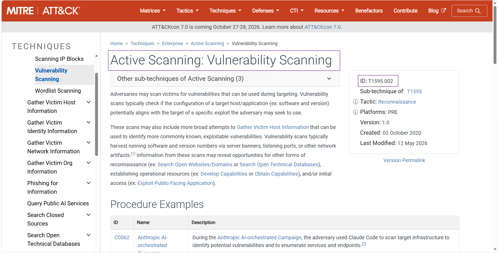
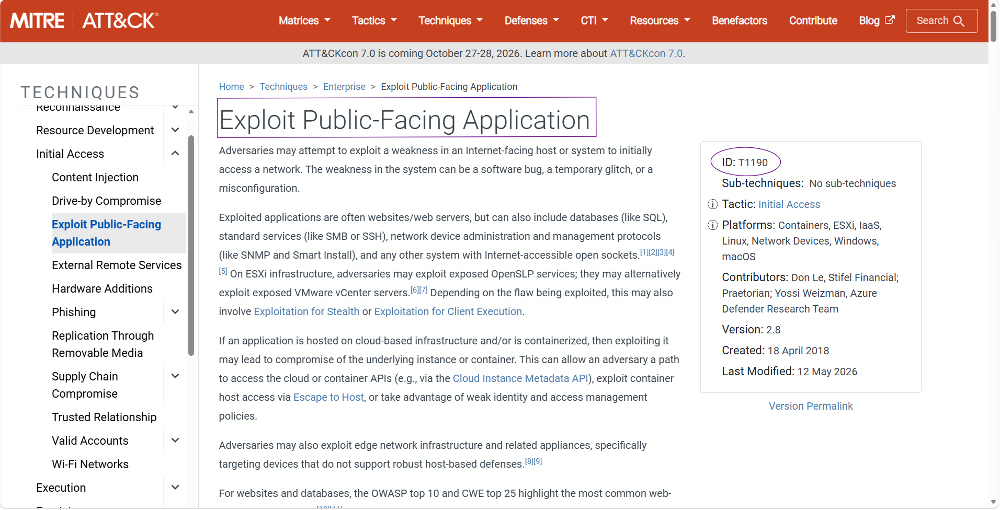
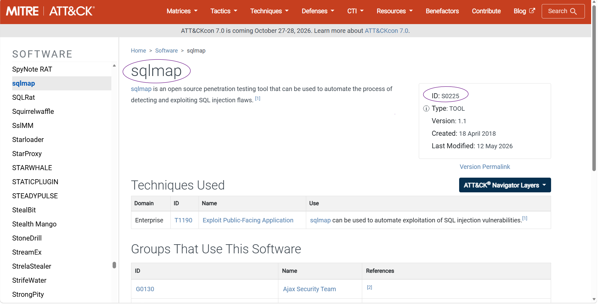
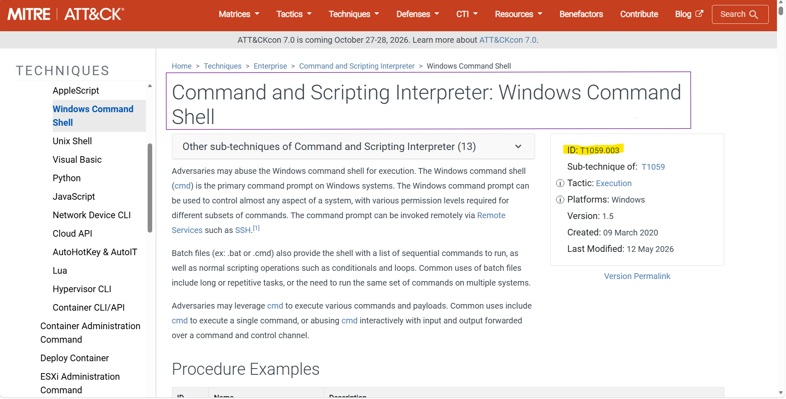
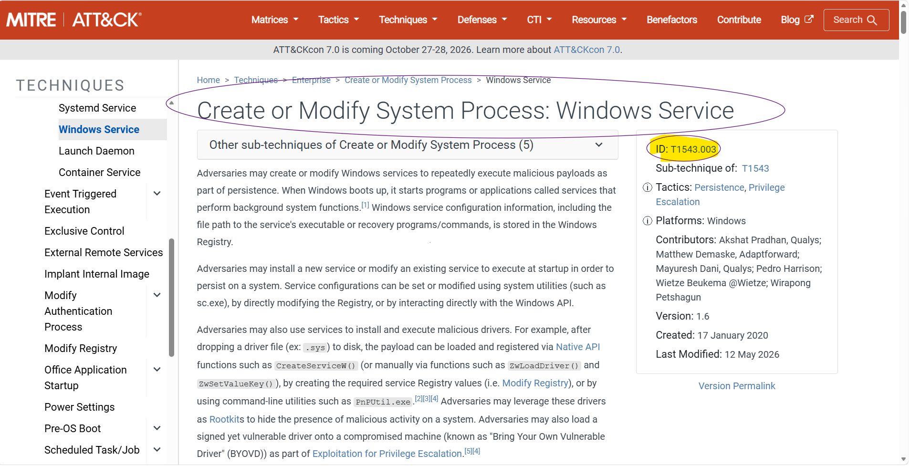
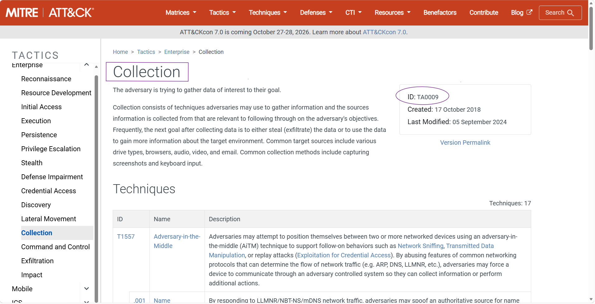
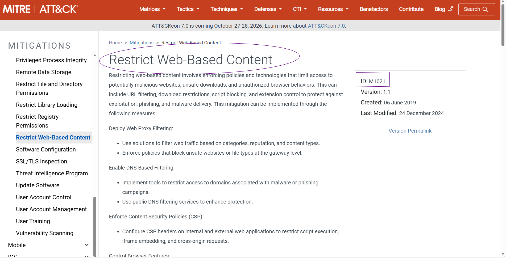
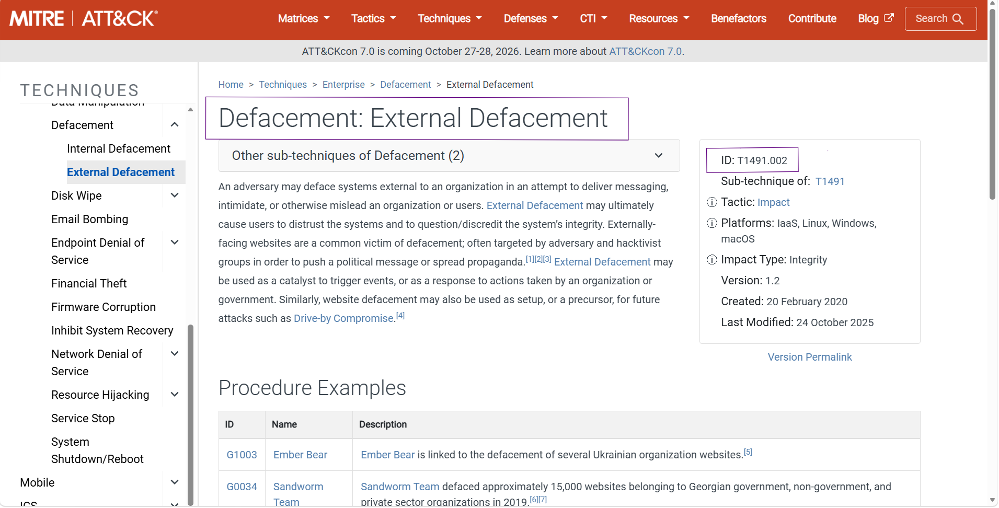

---

# OSINT Investigation (MITRE ATT&CK) – Case 03

## Overview

The **OSINT Investigation (MITRE ATT&CK) – Case 03** lab focuses on reconstructing an attack by identifying attacker behaviors and accurately mapping each activity to the MITRE ATT&CK Framework.

Throughout the investigation, the attack chain was reconstructed from the reconnaissance phase through initial compromise, command execution, privilege escalation, persistence, defense evasion, malware deployment, data collection, mitigation analysis, and the final impact on the victim organization.

Unlike malware reverse engineering or packet analysis, this investigation emphasized understanding attacker tactics, techniques, and procedures (TTPs) using the MITRE ATT&CK knowledge base to identify every stage of the intrusion.

The primary objective of this lab was to strengthen practical knowledge of MITRE ATT&CK while improving incident investigation, threat hunting, and SOC analysis skills.

---

# Scenario

During an active Incident Response engagement at **Permalink Software**, the SOC team detected abnormal outbound traffic originating from one of the organization's endpoints communicating with a known malicious IP address.

Correlation between Network Intrusion Detection System (NIDS) alerts and Threat Intelligence feeds indicated that the endpoint had been compromised.

Further investigation revealed that the attacker performed reconnaissance against the organization's public-facing infrastructure, exploited an SQL Injection vulnerability, established a reverse shell, escalated privileges, created persistence through Windows Services, disabled endpoint security controls, deployed additional malware, collected sensitive information, exfiltrated intellectual property through GitHub, and finally modified the organization's public website.

The investigation focused on mapping every observed activity to the appropriate MITRE ATT&CK techniques and understanding the complete attacker kill chain.

---

# Investigation Process

---

# Stage 1 – Reconnaissance

The investigation began by reviewing suspicious network activity originating from an external IP address.

Analysis showed the attacker used the **Nmap Scripting Engine (NSE)** to perform automated vulnerability scanning against the organization's public-facing infrastructure.

This behavior maps to the Vulnerability Scanning sub-technique.

### MITRE ATT&CK

**Technique:** T1595.002 – Active Scanning: Vulnerability Scanning

### Evidence

---

# Stage 2 – Initial Access

After identifying vulnerable services, the attacker exploited a SQL Injection vulnerability within an Internet-facing application.

The compromise provided direct access to the underlying server without requiring valid credentials.

This behavior maps to Exploit Public-Facing Application.

### MITRE ATT&CK

**Technique:** T1190 – Exploit Public-Facing Application

### Evidence

---

# Stage 3 – Tool Usage

Investigation revealed that the attacker automated SQL Injection using **sqlmap**.

Rather than exploiting the vulnerability manually, sqlmap was used to identify injectable parameters and obtain remote code execution.

### MITRE ATT&CK

**Software:** S0768 – sqlmap

### Evidence

---

# Stage 4 – Command Execution

Following successful exploitation, the attacker launched **cmd.exe** to establish a remote reverse shell.

The Windows Command Shell was abused to execute system commands and interact with the compromised server.

### MITRE ATT&CK

**Technique:** T1059.003 – Command and Scripting Interpreter: Windows Command Shell

### Evidence

---

# Stage 5 – Privilege Escalation

The attacker escalated privileges by abusing **SeImpersonatePrivilege** and impersonating another user's security token.

Investigation also identified the use of the **ImpersonateLoggedOnUser** API, which is commonly monitored to detect Token Impersonation attacks.

### MITRE ATT&CK

**Technique:** T1134.001 – Access Token Manipulation: Token Impersonation/Theft

### Evidence

---

# Stage 6 – Persistence

To maintain long-term access, the attacker modified an existing Windows Service by replacing its ImagePath with a malicious reverse shell payload.

This ensured the payload would automatically execute whenever the service started.

### MITRE ATT&CK

**Technique:** T1543.003 – Create or Modify System Process: Windows Service

### Evidence

---

# Stage 7 – Defense Evasion

Endpoint logs revealed that the organization's Endpoint Detection and Response (EDR) solution had been disabled.

Disabling defensive tools reduced visibility and allowed the attacker to continue operating without detection.

### MITRE ATT&CK

**Technique:** T1562.001 – Impair Defenses: Disable or Modify Tools

### Evidence

> **Note**
>
> The latest versions of MITRE ATT&CK introduce **T1685 – Disable or Modify Tools**.
>
> However, the Cyberhaze lab still follows the previous ATT&CK mapping, making **T1562.001** the expected answer for this exercise.

---

# Stage 8 – Malware Deployment

The investigation identified the deployment of **ccf32**, a malware family designed to collect information from compromised systems.

Analysis of its documented behavior showed that the malware primarily performs automated data collection before exfiltration.

### MITRE ATT&CK

**Software:** S1043 – ccf32

**Associated Tactic:** TA0009 – Collection

### Evidence

---

# Stage 9 – Data Exfiltration Mitigation

After collecting sensitive files and intellectual property, the attacker uploaded the stolen data to a public GitHub repository.

The investigation reviewed MITRE ATT&CK mitigations capable of preventing this type of activity.

The most appropriate mitigation was restricting unauthorized access to external web services.

### MITRE ATT&CK

**Mitigation:** M1021 – Restrict Web-Based Content

### Evidence

---

# Stage 10 – Impact

To complete the attack, the adversary modified the organization's public-facing website and displayed propaganda messages.

This behavior represents website defacement intended to damage the organization's reputation.

### MITRE ATT&CK

**Technique:** T1491.002 – Defacement: External Defacement

### Evidence

---

# MITRE ATT&CK Summary

| Attack Phase         | Technique                                 |
| -------------------- | ----------------------------------------- |
| Reconnaissance       | T1595.002 – Vulnerability Scanning        |
| Initial Access       | T1190 – Exploit Public-Facing Application |
| Execution            | T1059.003 – Windows Command Shell         |
| Privilege Escalation | T1134.001 – Token Impersonation           |
| Persistence          | T1543.003 – Windows Service               |
| Defense Evasion      | T1562.001 – Disable or Modify Tools       |
| Collection           | TA0009 – Collection (ccf32 Malware)       |
| Mitigation           | M1021 – Restrict Web-Based Content        |
| Impact               | T1491.002 – External Defacement           |

---

# Key Findings

* Identified reconnaissance through Nmap vulnerability scanning.
* Confirmed exploitation of a public-facing application using SQL Injection.
* Identified sqlmap as the exploitation tool.
* Confirmed attacker command execution using Windows Command Shell.
* Detected privilege escalation through Token Impersonation.
* Observed persistence via Windows Service modification.
* Identified EDR tampering as a defense evasion technique.
* Analyzed the deployment of ccf32 data collection malware.
* Identified the appropriate MITRE mitigation against GitHub-based exfiltration.
* Confirmed website defacement as the final attacker objective.
* Successfully reconstructed the complete attack chain using the MITRE ATT&CK Framework.

---

# Skills Demonstrated

* MITRE ATT&CK Mapping
* Threat Hunting
* Incident Response
* OSINT Investigation
* SOC Analysis
* Adversary Behavior Analysis
* Threat Intelligence
* Windows Persistence Analysis
* Privilege Escalation Analysis
* Defense Evasion Analysis
* Cyber Threat Analysis

---

# Conclusion

This investigation demonstrated how the MITRE ATT&CK Framework can be used to accurately reconstruct an attack by mapping every observed adversary behavior to its corresponding tactics and techniques.

Beginning with external reconnaissance and SQL Injection, the attacker established command execution, escalated privileges, created persistence, disabled defensive tools, deployed collection malware, exfiltrated sensitive information through GitHub, and ultimately defaced the organization's public-facing website.

By correlating each activity with MITRE ATT&CK, the complete attack lifecycle was successfully reconstructed, strengthening practical understanding of attacker behavior and reinforcing skills commonly required during real-world SOC investigations, incident response engagements, and threat hunting operations.
