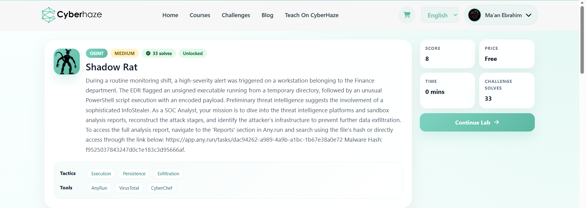
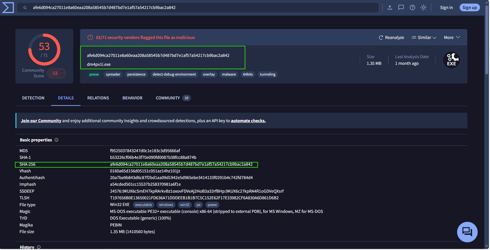
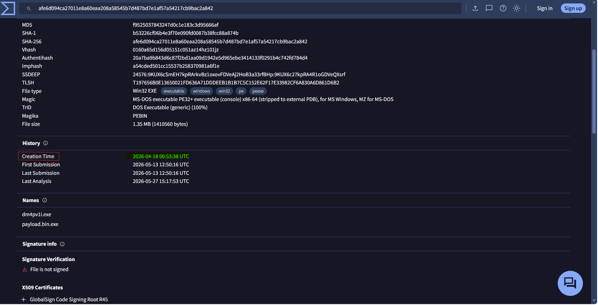

---

# Shadow Rat Investigation (Agent Tesla Malware Analysis)

## Overview

The **Shadow Rat** investigation focused on analyzing a malicious Windows executable associated with the **Agent Tesla** information stealer. The objective of this investigation was to reconstruct the malware's behavior using dynamic malware analysis, threat intelligence, and sandbox analysis.

Throughout the investigation, multiple threat intelligence platforms including **ANY.RUN**, **VirusTotal**, and **CyberChef** were used to analyze the malware execution chain, persistence mechanisms, reconnaissance activities, network communication, malware configuration, and attacker infrastructure.

The investigation successfully identified the malware family, persistence techniques, reconnaissance behavior, SMTP exfiltration infrastructure, PowerShell execution chain, and multiple Indicators of Compromise (IOCs).

---

# Scenario

A high-severity EDR alert was triggered on a workstation belonging to the Finance department after an unsigned executable launched from a temporary directory.

Shortly afterward, an obfuscated PowerShell command executed an additional payload. Threat intelligence indicated the malware was an **Agent Tesla** information stealer designed to harvest credentials, gather host information, and exfiltrate stolen data through SMTP.

The objective was to reconstruct the complete attack chain and identify the attacker's infrastructure.

---

# Investigation Process

---

# Stage 1 — Malware Identification

The investigation started by identifying the submitted malware sample using its MD5 hash.

The sample was analyzed in VirusTotal and ANY.RUN where multiple antivirus vendors classified it as **Agent Tesla**, a well-known credential stealing malware family.

### Malware Information

* MD5

```
f9525037843247d0c1e183c3d95666af
```

* SHA256

```
afe6d094ca27011e8a60eaa208a58545b7d487bd7e1af57a54217cb9bac2a842
```

### Evidence



---

# Stage 2 — Malware Compilation Time

Static analysis revealed the malware compilation timestamp embedded within the PE header.

### Creation Time

```
2026-04-18 00:53:38 UTC
```

### Evidence



---

# Stage 3 — External Network Reconnaissance

During execution, the malware contacted a legitimate public API to determine whether the infected machine was running inside a hosting provider or cloud environment.

This is a common anti-analysis technique used by malware.

### Contacted URL

```
http://ip-api.com/line/?fields=hosting
```

### Evidence

*(Insert Screenshot)*

---

# Stage 4 — Persistence

ANY.RUN showed the malware creating a Batch file inside the Windows Startup folder.

This ensures execution after every user logon.

### Created File

```
C:\Users\admin\AppData\Roaming\Microsoft\Windows\Start Menu\Programs\Startup\aleusbykhvziovkuiqfoiruiutibg.bat
```

### MITRE ATT&CK

```
T1547.001
Boot or Logon Autostart Execution
Registry Run Keys / Startup Folder
```

### Evidence

*(Insert Screenshot)*

---

# Stage 5 — AutoIt Loader

The malware dropped an AutoIt executable into the temporary directory before launching it.

PowerShell executed the AutoIt loader while passing an additional file as an argument.

### Executed Command

```
"C:\Users\admin\AppData\Local\Temp\ljers.exe"
```

### Passed Argument

```
hunuhq
```

### Evidence

*(Insert Screenshot)*

---

# Stage 6 — Encoded PowerShell Execution

The malware executed an obfuscated Base64 PowerShell command.

After decoding the command using **CyberChef**, the second-stage payload execution became visible.

### Decoded Command

```powershell
Start-Process -FilePath "$env:TEMP\ljers.exe" -ArgumentList "$env:TEMP\hunuhq"
```

### Environment Variable

```
env:TEMP
```

### Evidence

*(Insert Screenshot)*

---

# Stage 7 — Registry Discovery

During execution, the AutoIt loader queried multiple Windows Registry keys to gather host configuration information, including language settings and mouse configuration.

### MITRE ATT&CK

```
T1012
Query Registry
```

### Evidence

*(Insert Screenshot)*

---

# Stage 8 — Malware Configuration Extraction

The malware configuration was extracted directly from the running **Agent Tesla** process.

The SMTP configuration contained the attacker's infrastructure used to exfiltrate stolen credentials.

### SMTP Host

```
mail.onionmail.org
```

### Protocol

```
SMTP
```

### Port

```
25
```

### Email Address

```
sendboxorigin@onionmail.org
```

### Evidence

*(Insert Screenshot)*

---

# Stage 9 — Malware Family

Behavioral analysis, YARA detection, and extracted configuration confirmed that the malware belongs to the **Agent Tesla** family.

Agent Tesla is an information stealer capable of collecting:

* Browser Credentials
* FTP Credentials
* Email Credentials
* VPN Credentials
* Clipboard Data
* Keystrokes

### Malware Family

```
Agent Tesla
```

### Evidence

*(Insert Screenshot)*

---

# Indicators of Compromise (IOCs)

## File Hashes

**MD5**

```
f9525037843247d0c1e183c3d95666af
```

**SHA256**

```
afe6d094ca27011e8a60eaa208a58545b7d487bd7e1af57a54217cb9bac2a842
```

---

## Domains

```
mail.onionmail.org
ip-api.com
```

---

## URL

```
http://ip-api.com/line/?fields=hosting
```

---

## Persistence File

```
aleusbykhvziovkuiqfoiruiutibg.bat
```

---

## Executables

```
payload.bin.exe
ljers.exe
charmap.exe
```

---

# MITRE ATT&CK Mapping

| Tactic            | Technique                                      |
| ----------------- | ---------------------------------------------- |
| Execution         | T1059.001 – PowerShell                         |
| Persistence       | T1547.001 – Startup Folder                     |
| Discovery         | T1012 – Query Registry                         |
| Discovery         | T1082 – System Information Discovery           |
| Credential Access | T1555 – Credentials from Password Stores       |
| Exfiltration      | T1048 – Exfiltration Over Alternative Protocol |
| Defense Evasion   | PowerShell Base64 Encoding                     |

---

# Key Findings

* Identified the malware as **Agent Tesla**.
* Determined the malware compilation timestamp.
* Observed external reconnaissance using **ip-api.com**.
* Identified persistence through the Windows Startup folder.
* Recovered the dropped AutoIt loader.
* Decoded the obfuscated PowerShell execution chain.
* Extracted the malware SMTP configuration.
* Identified the attacker email account used for credential exfiltration.
* Mapped attacker behaviors to the MITRE ATT&CK Framework.
* Collected multiple Indicators of Compromise for future detection.

---

# Skills Demonstrated

* Malware Analysis
* Dynamic Analysis
* Threat Intelligence
* ANY.RUN Analysis
* VirusTotal Investigation
* CyberChef
* IOC Extraction
* PowerShell Analysis
* MITRE ATT&CK Mapping
* Incident Response
* SOC Investigation

---

# Tools Used

* ANY.RUN
* VirusTotal
* CyberChef
* MITRE ATT&CK Framework

---

# Conclusion

This investigation successfully reconstructed the complete execution chain of an **Agent Tesla** malware sample using dynamic sandbox analysis and threat intelligence.

Beginning with the initial payload execution, the malware established persistence through the Windows Startup folder, executed an AutoIt loader using an obfuscated PowerShell command, gathered system information through Windows Registry queries, contacted external services for host reconnaissance, and configured SMTP infrastructure to exfiltrate stolen credentials.

By combining **ANY.RUN**, **VirusTotal**, **CyberChef**, and the **MITRE ATT&CK Framework**, the full malware behavior, attacker infrastructure, and Indicators of Compromise were identified, providing a comprehensive understanding of the attack lifecycle and strengthening practical malware analysis and SOC investigation skills.
