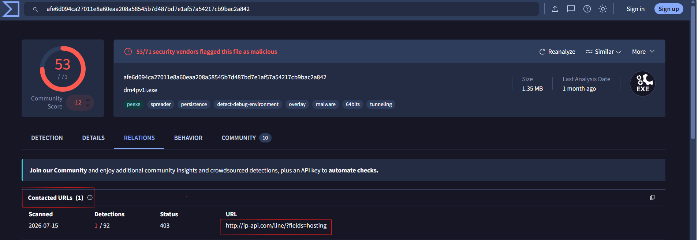

---

# Shadow Rat – OSINT Threat Intelligence Investigation (Agent Tesla)

## Overview

The **Shadow Rat – OSINT Threat Intelligence Investigation** focused on analyzing a malware execution using public threat intelligence resources and sandbox analysis to reconstruct the attack lifecycle.

The investigation relied primarily on **ANY.RUN**, **VirusTotal**, and **CyberChef** to identify the malware family, persistence mechanisms, execution chain, attacker infrastructure, reconnaissance behavior, and malware configuration.

Throughout the investigation, the malware was identified as **Agent Tesla**, an information-stealing malware that utilizes PowerShell, AutoIt, registry reconnaissance, persistence through the Windows Startup folder, SMTP-based data exfiltration, and external reconnaissance APIs.

The objective of this investigation was to understand the complete infection chain while correlating malware behavior with the **MITRE ATT&CK Framework**.

---

# Scenario

A high-severity alert was generated after an unsigned executable was launched from a temporary directory on a Finance department workstation.

EDR telemetry showed the execution of an encoded PowerShell command, followed by the launch of an AutoIt script responsible for deploying the final malware payload.

Threat intelligence suggested the malware belonged to an InfoStealer family capable of collecting browser credentials, FTP credentials, VPN information, email data, and transmitting stolen information to an attacker-controlled SMTP server.

The investigation focused on reconstructing the attack using publicly available intelligence sources.

---

# Investigation Process

---

# Stage 1 – Malware Identification

Static analysis using VirusTotal identified the suspicious executable and provided multiple indicators regarding its compilation, reputation, contacted infrastructure, and malware classification.

### Findings

* Malware MD5 identified.
* PE32+ Windows executable.
* AutoIt loader detected.
* Agent Tesla indicators observed.
---

# Stage 2 – Malware Timeline

VirusTotal metadata revealed the malware compilation timestamp.

### Finding

**Creation Time**

```
2026-04-18 00:53:38 UTC
```
### Evidence


---

# Stage 3 – Initial Execution

Sandbox analysis showed the malware launching from the Desktop before dropping multiple files into the Windows temporary directory.

Dropped components included:

* ljers.exe
* hunuhq
* Startup BAT file

The malware then executed PowerShell using an encoded Base64 command.

### MITRE ATT&CK

**T1059.001 – PowerShell**

### Evidence


---

# Stage 4 – PowerShell Analysis

The Base64 command was decoded using CyberChef.

Decoded command:

```powershell
Start-Process -FilePath "$env:TEMP\ljers.exe" -ArgumentList "$env:TEMP\hunuhq"
```

The malware leveraged the **env:TEMP** environment variable to locate the second-stage executable.

### Evidence

*(Insert Screenshot Here)*

---

# Stage 5 – AutoIt Execution

PowerShell launched the AutoIt executable:

```
ljers.exe
```

passing the configuration file:

```
hunuhq
```

AutoIt acted as the malware loader responsible for executing the final payload.

### MITRE ATT&CK

**T1059.010 – AutoHotKey & AutoIT**

### Evidence

*(Insert Screenshot Here)*

---

# Stage 6 – Persistence

The malware established persistence by creating a batch file inside the Windows Startup folder.

Created File

```
C:\Users\admin\AppData\Roaming\Microsoft\Windows\Start Menu\Programs\Startup\aleusbykhvziovkuiqfoiruiutibg.bat
```

This ensured malware execution after every user logon.

### MITRE ATT&CK

**T1547.001 – Registry Run Keys / Startup Folder**

### Evidence

*(Insert Screenshot Here)*

---

# Stage 7 – Host Reconnaissance

Before stealing information, the malware collected environmental information.

Observed reconnaissance included:

* Supported Language
* Mouse Settings
* Registry Queries

### MITRE ATT&CK

**T1012 – Query Registry**

### Evidence

*(Insert Screenshot Here)*

---

# Stage 8 – External Reconnaissance

Network analysis revealed communication with the following API:

```
http://ip-api.com/line/?fields=hosting
```

The malware queried the external service to determine whether the infected host was running inside a hosting provider or cloud environment.

### MITRE ATT&CK

**T1016 – System Network Configuration Discovery**

### Evidence

*(Insert Screenshot Here)*

---

# Stage 9 – Malware Configuration Extraction

ANY.RUN extracted the embedded Agent Tesla configuration.

Configuration included:

SMTP Server

```
mail.onionmail.org
```

Username

```
sendboxorigin@onionmail.org
```

Protocol

```
SMTP (Port 25)
```

This configuration was used to exfiltrate stolen credentials.

### Evidence

*(Insert Screenshot Here)*

---

# Stage 10 – Credential Theft

Behavioral analysis confirmed that Agent Tesla attempted to steal:

* Browser Credentials
* Email Credentials
* FTP Credentials
* VPN Credentials

The malware also accessed browser databases and initiated outbound SMTP communications.

### MITRE ATT&CK

**T1555 – Credentials from Password Stores**

### Evidence

*(Insert Screenshot Here)*

---

# Stage 11 – Malware Family Identification

Threat intelligence confirmed the malware family as:

```
Agent Tesla
```

Agent Tesla is an information-stealing malware capable of collecting sensitive information and transmitting it to attacker-controlled infrastructure using SMTP.

### Evidence

*(Insert Screenshot Here)*

---

# Indicators of Compromise (IOCs)

## File Hashes

**MD5**

```
f9525037843247d0c1e183c3d95666af
```

**SHA1**

```
b53226cf06b4e3f70e090fd0087b38fcc88a874b
```

**SHA256**

```
afe6d094ca27011e8a60eaa208a58545b7d487bd7e1af57a54217cb9bac2a842
```

---

## Domains

```
mail.onionmail.org
ip-api.com
```

---

## URL

```
http://ip-api.com/line/?fields=hosting
```

---

## Persistence File

```
aleusbykhvziovkuiqfoiruiutibg.bat
```

---

# MITRE ATT&CK Summary

| Stage             | Technique                                      |
| ----------------- | ---------------------------------------------- |
| Execution         | T1059.001 – PowerShell                         |
| Execution         | T1059.010 – AutoIt                             |
| Persistence       | T1547.001 – Startup Folder                     |
| Discovery         | T1012 – Query Registry                         |
| Discovery         | T1016 – System Network Configuration Discovery |
| Credential Access | T1555 – Credentials from Password Stores       |

---

# Key Findings

* Identified Agent Tesla as the malware family.
* Reconstructed the complete execution chain.
* Decoded the PowerShell Base64 payload.
* Identified AutoIt as the second-stage loader.
* Confirmed persistence via the Windows Startup folder.
* Identified reconnaissance against Windows Registry.
* Detected external reconnaissance using ip-api.com.
* Extracted attacker SMTP infrastructure.
* Collected multiple Indicators of Compromise.
* Successfully mapped malware behavior to MITRE ATT&CK.

---

# Skills Demonstrated

* Malware OSINT Investigation
* Threat Intelligence
* Malware Analysis
* Sandbox Analysis
* PowerShell Analysis
* CyberChef
* VirusTotal
* ANY.RUN
* IOC Extraction
* MITRE ATT&CK Mapping
* Incident Response
* SOC Analysis

---

# Tools Used

* ANY.RUN
* VirusTotal
* CyberChef
* MITRE ATT&CK Framework

---

# Conclusion

This investigation successfully reconstructed the execution chain of an **Agent Tesla** infection using open-source threat intelligence platforms and dynamic malware analysis.

Starting from an encoded PowerShell command, the investigation revealed the use of an AutoIt loader, persistence through the Startup folder, registry-based host reconnaissance, external environment checks using `ip-api.com`, credential theft from multiple applications, and SMTP-based data exfiltration through attacker-controlled infrastructure.

By combining sandbox telemetry, static malware intelligence, and MITRE ATT&CK mapping, the complete attack lifecycle was documented, demonstrating practical skills in malware investigation, threat intelligence, IOC extraction, and behavioral analysis suitable for SOC and DFIR environments.


دي هتكون من أفضل مشاريع الـ OSINT/Threat Intelligence في البورتفوليو، ومناسبة جدًا لوظائف SOC L1 وDFIR.
