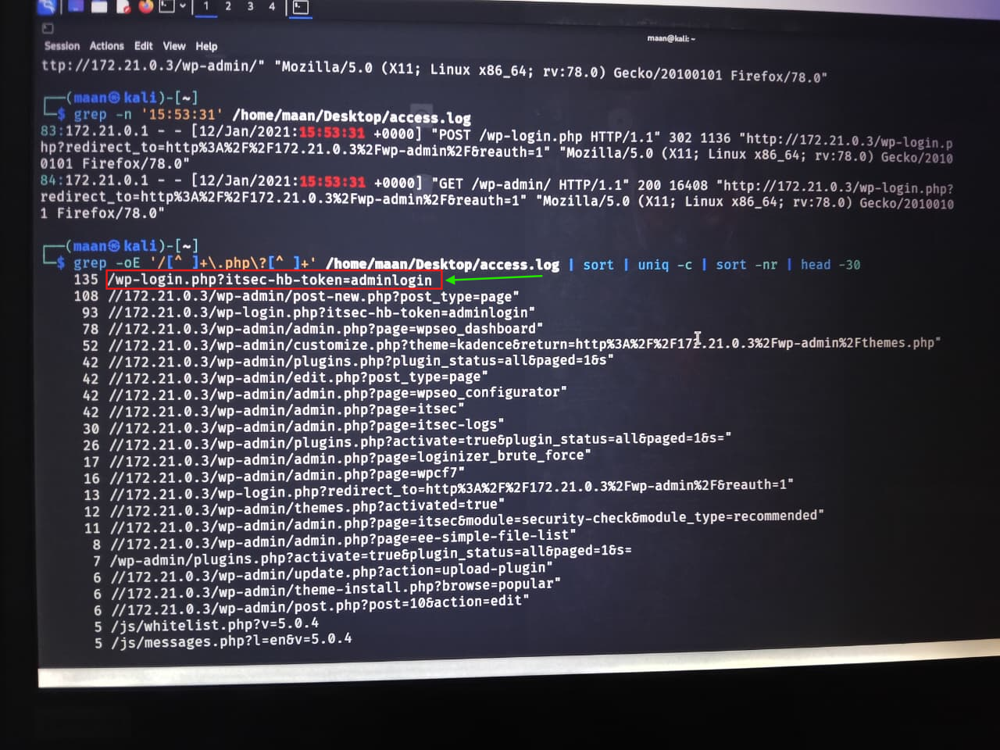
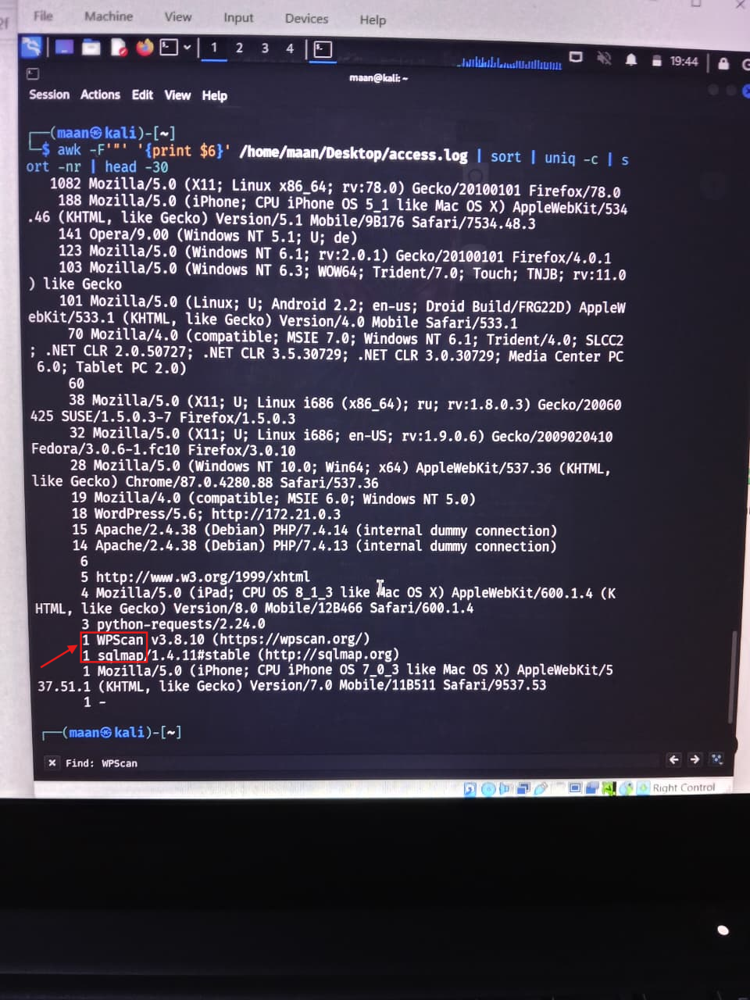
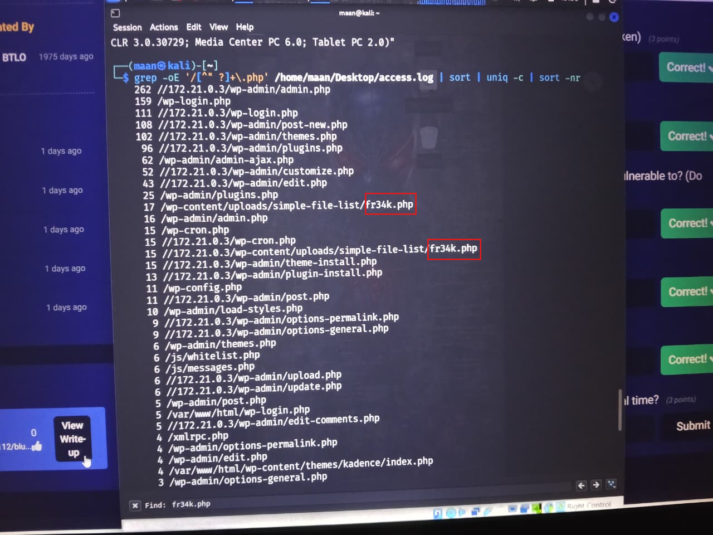
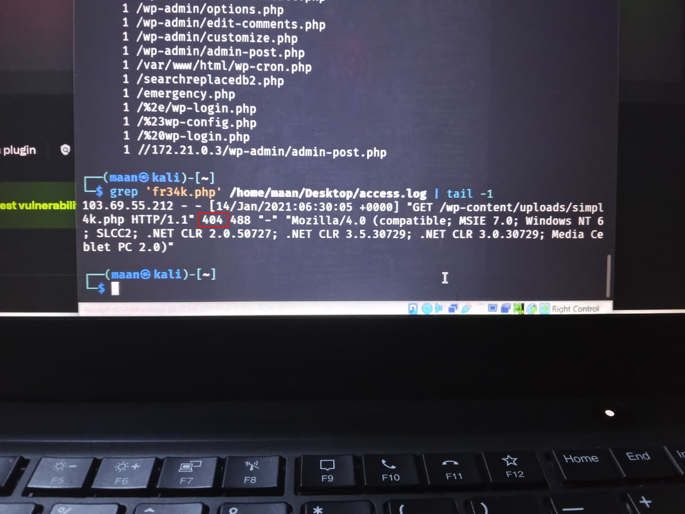

# Compromised WordPress Lab

## Overview

The **Compromised WordPress Lab** focused on analyzing Apache access logs to reconstruct a web application compromise and determine how an attacker gained administrative access, exploited vulnerable WordPress components, and ultimately deployed a PHP web shell.

During the investigation, Apache access logs were analyzed using command-line tools such as `grep`, `sort`, and `uniq` to identify suspicious requests, attacker activity, authentication attempts, vulnerable plugins, malicious files, and web shell execution.

The investigation successfully reconstructed the attack chain from initial access to plugin exploitation and post-exploitation activity.

The primary objective was to identify the attacker-controlled resources, determine the exploited WordPress plugin, identify the deployed web shell, and extract relevant Indicators of Compromise (IOCs).

---

# Scenario

One of the company's WordPress websites was suspected to have been compromised.

The primary hypothesis was that an installed WordPress plugin contained a vulnerability that allowed an attacker to gain access to the underlying server and execute malicious actions.

The investigation focused on the provided Apache `access.log` file to determine:

* The URI of the hidden WordPress admin login panel
* Tools used by the attacker
* The vulnerable WordPress plugin
* The exploitation activity
* The deployed PHP web shell
* The final HTTP response code returned when the web shell was accessed
* Indicators of Compromise
* The overall attack timeline

---

# Investigation Process

## Stage 1 – Admin Login Panel Identification

The investigation began by searching the Apache access logs for WordPress authentication-related requests.

The following command was used:

```bash
grep -Ei 'wp-admin|wp-login|login' /home/maan/Desktop/access.log | head -50
```

The logs revealed successful access to the WordPress administration panel following authentication.

Further analysis identified a modified WordPress login endpoint using the following token:

```text
/wp-login.php?itsec-hb-token=adminlogin
```

The `itsec-hb-token=adminlogin` parameter indicated that the default WordPress login endpoint had been hidden or modified.

### Evidence

The relevant requests showed:

```text
GET /wp-login.php?itsec-hb-token=adminlogin
```

and subsequent successful access to:

```text
GET /wp-admin/
```

This confirmed that the attacker gained access through the hidden WordPress administrative login panel.

---

# Stage 2 – Attacker Tool Identification

The Apache logs were searched for common penetration-testing and web security tools.

The following command was used:

```bash
grep -Eio 'sqlmap|nikto|nmap|curl|wget|python|burp|gobuster|dirbuster|wpscan|metasploit|hydra|nuclei' /home/maan/Desktop/access.log | sort | uniq -c
```

The analysis identified the following tools:

```text
sqlmap
WPScan
```

### Findings

**WPScan** was identified as a WordPress security scanner and was likely used for WordPress enumeration and vulnerability discovery.

**sqlmap** was also observed in the logs, indicating automated SQL injection testing or exploitation activity.

### Evidence

```text
2 sqlmap
1 wpscan
1 WPScan
```

---

# Stage 3 – Vulnerable Plugin Investigation

The investigation then focused on identifying vulnerable WordPress plugins.

Initial analysis indicated suspicious activity involving the **Contact Form 7** plugin.

However, further investigation of the access logs revealed activity associated with another plugin that played a direct role in the compromise.

The following command was used:

```bash
grep -Ei 'simple.*file|file.*simple' /home/maan/Desktop/access.log | head -30
```

The logs revealed repeated access to:

```text
/wp-content/plugins/simple-file-list/
```

The attacker also accessed the plugin's administrative interface:

```text
/wp-admin/admin.php?page=ee-simple-file-list
```

The plugin was identified as:

**Simple File List**

The logs also showed that the plugin was activated:

```text
GET /wp-admin/plugins.php?action=activate&plugin=simple-file-list%2Fee-simple-file-list.php...
```

This activity strongly connected the plugin with the subsequent malicious file deployment.

---

# Stage 4 – Web Shell Identification

The Apache logs were analyzed to identify PHP files that were accessed outside the normal WordPress administrative structure.

The following command was used:

```bash
grep -oE '/[^" ?]+\.php' /home/maan/Desktop/access.log | sort | uniq -c | sort -nr
```

The results revealed a suspicious PHP file:

```text
/wp-content/uploads/simple-file-list/fr34k.php
```

The file appeared repeatedly in the logs:

```text
17 /wp-content/uploads/simple-file-list/fr34k.php
```

The location was particularly suspicious because the file was stored under the WordPress uploads directory associated with the Simple File List plugin.

This strongly indicated that the file was an attacker-uploaded PHP web shell.

### Web Shell

```text
fr34k.php
```

### Full Path

```text
/wp-content/uploads/simple-file-list/fr34k.php
```

The web shell provided the attacker with a mechanism to interact with the compromised server after gaining access.

---

# Stage 5 – Web Shell Access Analysis

The final access to the identified web shell was investigated using:

```bash
grep 'fr34k.php' /home/maan/Desktop/access.log | tail -1
```

The final request was:

```text
103.69.55.212 - - [14/Jan/2021:06:30:05 +0000]
"GET /wp-content/uploads/simple-file-list/fr34k.php HTTP/1.1"
404 488
```

The HTTP response code was:

```text
404
```

This indicates that the web shell was no longer available at the time of the final request.

The final access originated from:

```text
103.69.55.212
```

---

# Stage 6 – Attack Timeline Reconstruction

Based on the Apache logs, the attack can be reconstructed as follows:

```text
WordPress Login Discovery
        ↓
Hidden Login Panel Identified
        ↓
Administrative Access
        ↓
WordPress Enumeration
        ↓
WPScan / SQLmap Activity
        ↓
Simple File List Plugin Identified
        ↓
Plugin Activated
        ↓
Malicious PHP File Uploaded
        ↓
fr34k.php Web Shell
        ↓
Web Shell Access
        ↓
Final Request Returned HTTP 404
```

This timeline demonstrates how log analysis can be used to reconstruct a WordPress compromise without requiring direct access to the compromised server.

---

# Indicators of Compromise (IOCs)

| Type                        | Value                                            |
| --------------------------- | ------------------------------------------------ |
| Hidden Login URI            | `/wp-login.php?itsec-hb-token=adminlogin`        |
| Tool                        | WPScan                                           |
| Tool                        | sqlmap                                           |
| Vulnerable/Exploited Plugin | Simple File List                                 |
| Plugin Path                 | `/wp-content/plugins/simple-file-list/`          |
| Web Shell                   | `fr34k.php`                                      |
| Web Shell Path              | `/wp-content/uploads/simple-file-list/fr34k.php` |
| Final Web Shell Access IP   | `103.69.55.212`                                  |
| Final HTTP Response         | `404`                                            |

---

# Key Findings

* Identified the hidden WordPress administrative login panel.
* Confirmed the token used by the login panel.
* Identified **WPScan** as one of the tools used by the attacker.
* Identified **sqlmap** activity in the Apache logs.
* Identified the **Simple File List** WordPress plugin involved in the compromise.
* Confirmed that the plugin was activated during the attack.
* Identified the malicious PHP web shell named **fr34k.php**.
* Located the web shell under the WordPress uploads directory.
* Identified repeated access to the web shell.
* Identified the final web shell request.
* Confirmed that the final request returned HTTP **404 Not Found**.
* Reconstructed the attack chain using Apache access logs.

---

# Tools Used

* Linux Terminal
* Apache Access Logs
* `grep`
* `sort`
* `uniq`
* `head`
* `tail`
* WPScan
* sqlmap
* WordPress
* Apache HTTP Server

---

# Skills Demonstrated

* Web Log Analysis
* Apache Log Analysis
* WordPress Forensics
* Threat Hunting
* Web Shell Detection
* IOC Identification
* Attack Timeline Reconstruction
* Log Filtering
* Command-Line Investigation
* Web Application Security
* Plugin Analysis
* Incident Response
* Digital Forensics

---

# MITRE ATT&CK Mapping

| Tactic              | Technique                                                       |
| ------------------- | --------------------------------------------------------------- |
| Initial Access      | T1190 – Exploit Public-Facing Application                       |
| Execution           | T1059 – Command and Scripting Interpreter                       |
| Persistence         | T1505.003 – Web Shell                                           |
| Discovery           | T1518 – Software Discovery                                      |
| Credential Access   | T1110 – Brute Force *(if supported by authentication evidence)* |
| Command and Control | T1505.003 – Web Shell                                           |

> **Note:** MITRE ATT&CK mappings should only be included where the observed log evidence supports the technique.

---

# Conclusion

The **Compromised WordPress** investigation demonstrated how Apache access logs can be used to reconstruct a web application compromise and identify attacker activity.

The investigation identified the hidden WordPress login endpoint:

```text
/wp-login.php?itsec-hb-token=adminlogin
```

Analysis of the logs also identified **WPScan** and **sqlmap** activity during the attack.

Further investigation revealed activity involving the **Simple File List** WordPress plugin, including plugin activation and subsequent access to a malicious PHP file.

The deployed web shell was identified as:

```text
fr34k.php
```

located at:

```text
/wp-content/uploads/simple-file-list/fr34k.php
```

The final request to the web shell originated from `103.69.55.212` and returned an HTTP **404** response, indicating that the malicious file was no longer accessible at that point.

Overall, the investigation successfully reconstructed the compromise chain and extracted actionable IOCs that can be used for future threat hunting, detection, and incident response activities.

---

