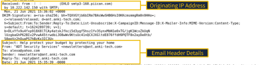
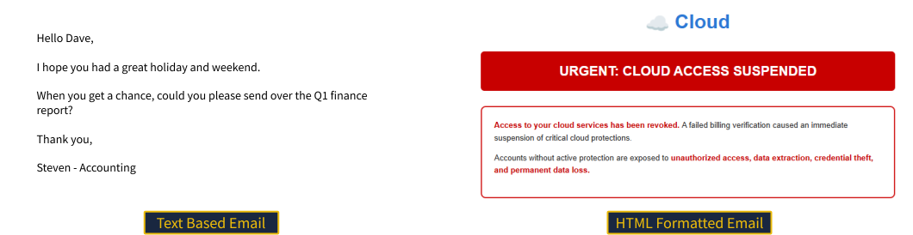
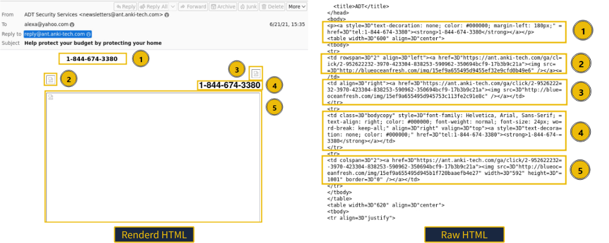
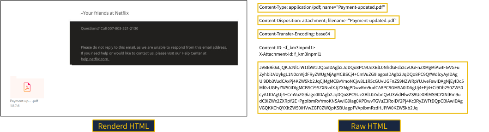
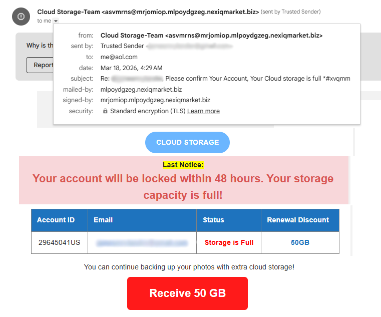

# Phishing Analysis


## Introduction

Spam and Phishing remain the most common social engineering threats facing modern organizations. While spam is often low-risk, phishing can trick users into disclosing sensitive information or unknowingly deploying malware. A single unsuspecting user who clicks a malicious link or opens an attachment can give an attacker an initial foothold in the network and cause huge damage to the company.

As a defender, your role involves analyzing email components to determine whether they are malicious or benign. By inspecting email headers, bodies, links, and attachments, analysts can identify phishing attempts, protect users, and improve an organization's overall security posture.

### Learning Objectives

- Learn the basics of email delivery.
- Explore email header analysis.
- Investigate email bodies.
- Learn different phishing techniques.
- Analyze suspicious emails safely.

---

## The Email Address
(616945d482ef350052080da1-1773844337743.svg)

Every email begins with a simple but structured address.

An email address consists of three components:

- **Username** – Identifies the mailbox.
- **@ Symbol** – Separates the user from the mail server.
- **Domain** – Specifies the destination mail server.

Example:

```
john@example.com
```

- Username → john
- Domain → example.com

Think of it like a postal address:

- Domain = Street or Building
- Username = Person living there

Together they allow mail servers to deliver emails to the correct recipient.

---

## Email Delivery


Three main protocols are responsible for email communication:

### SMTP

- Sends emails.
- Transfers outgoing mail between servers.

### POP3

- Downloads emails to one device.
- Usually removes messages from the server.
- Suitable for single-device access.

### IMAP

- Keeps emails stored on the server.
- Synchronizes multiple devices.
- Recommended for modern email services.

### Email Journey

1. Sender writes an email.
2. SMTP sends it to the sender's mail server.
3. DNS finds the recipient's mail server.
4. Email travels across the Internet.
5. Recipient retrieves it using POP3 or IMAP.

---

## Email Headers


Email headers contain valuable metadata that investigators use during phishing analysis.

Important fields include:

- From
- To
- Subject
- Date
- Return-Path
- Reply-To
- Received
- Message-ID

Headers help analysts identify:

- Email spoofing
- Mail routing
- Suspicious servers
- Original sender
- Authentication failures

Headers are one of the most important parts of every phishing investigation.

---

## Viewing the Message Source



Instead of viewing only the rendered email, analysts inspect the raw source.

The message source reveals:

- Complete email headers
- MIME boundaries
- HTML code
- Embedded links
- Attachments
- Encoding methods

This information is often hidden from normal users but essential during investigations.

---

## Email Body



The email body contains the message delivered to the recipient.

It may be:

- Plain Text
- HTML

HTML emails support:

- Images
- Buttons
- Hyperlinks
- Styling
- Embedded objects

Attackers frequently abuse HTML formatting to disguise malicious links behind legitimate-looking buttons.

---

## Viewing HTML Source Code



Viewing the HTML source allows analysts to inspect the actual structure behind an email.

This helps identify:

- Hidden URLs
- Embedded images
- Fake login forms
- Suspicious HTML elements
- Obfuscated links

Comparing the rendered message with its HTML source often exposes phishing indicators that users cannot easily see.

---

## Reconstructing Attachments



Attachments are stored inside emails using MIME encoding.

Important fields include:

- Content-Type
- Content-Disposition
- Content-Transfer-Encoding

Many attachments are encoded using Base64.

Security analysts can decode these files using tools such as:

- CyberChef
- Base64 Decoders

This allows attachments to be safely reconstructed and analyzed.

---

## Types of Phishing



Common phishing attacks include:

- Spam
- Phishing
- Spear Phishing
- Whaling
- Smishing
- Vishing

### Common Indicators

- Spoofed sender address
- Urgent language
- Brand impersonation
- Generic greetings
- Hidden links
- Shortened URLs
- Suspicious attachments
- Requests for credentials

### Safe Analysis

Always **defang** malicious indicators before sharing them.

Example:

Original

```
http://www.suspiciousdomain.com
```

Defanged

```
hxxp[://]www[.]suspiciousdomain[.]com
```

This prevents accidental clicks while sharing indicators with other analysts.

---

# Conclusion

Phishing continues to be one of the most successful attack vectors because it targets human behavior rather than software vulnerabilities.

Understanding email delivery, headers, HTML structure, attachments, and phishing techniques enables defenders to detect malicious emails more efficiently and strengthen organizational security.

These skills are fundamental for SOC Analysts, Incident Responders, Threat Hunters, and anyone working in Cybersecurity.
