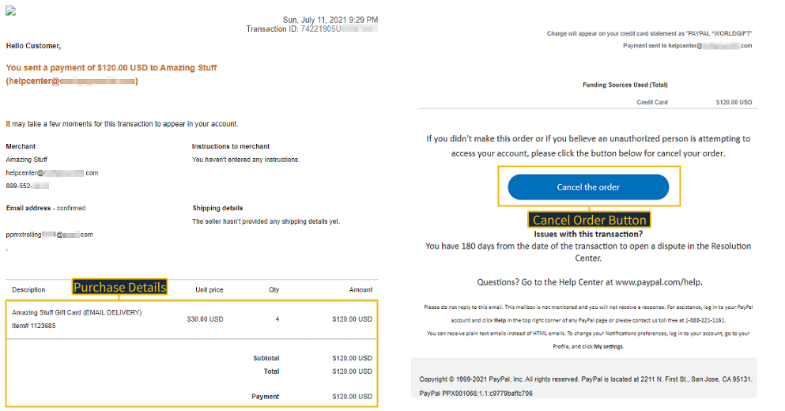
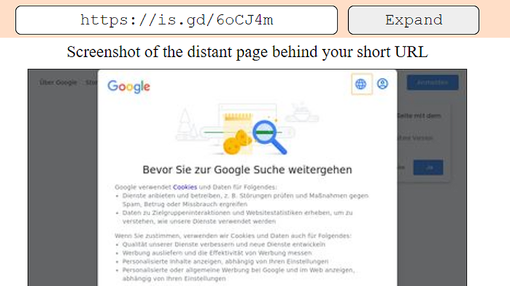
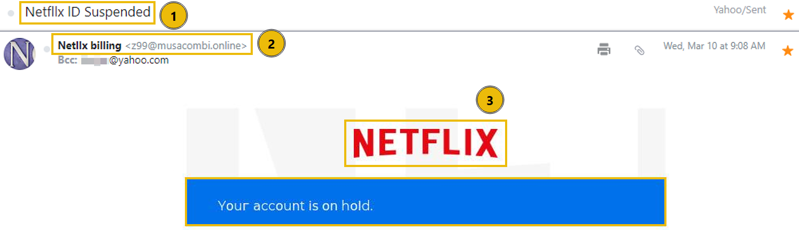
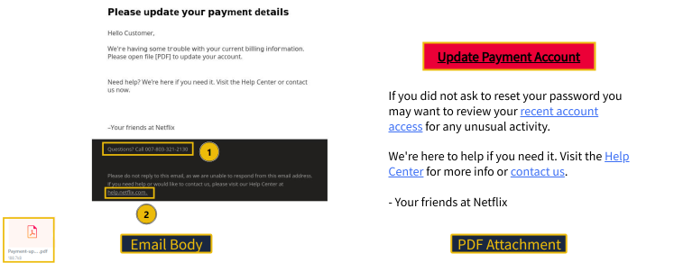

# Phishing Emails in Action


## Introduction

In the first room of the **Phishing Analysis** module, **Phishing Analysis Fundamentals**, you learned how to investigate email headers and bodies to identify common red flags. Now, we transition to practice by examining real phishing email samples.

This room focuses on the tactics attackers use to mirror legitimate communications. By analyzing real samples, you will learn to identify the subtle nuances that distinguish a routine notification from a sophisticated credential harvesting attempt.

> **Note:** The samples throughout this room contain information from actual emails. Proceed with caution if you attempt to interact with any IP, domain, or attachment.

### Objectives

- Identify common social engineering tactics used in phishing.
- Analyze red flags contained within phishing emails.
- Detect link manipulation and tracking pixels.
- Deconstruct credential harvesting and attachment manipulation.

### Prerequisites

Check out **Phishing Analysis Fundamentals** for an overview of email communications and analysis.

---

# Cancel Your Order

In this task, we will examine a sample email designed to mimic an official transaction receipt from **PayPal**. By analyzing this specific sample, we will focus on how attackers leverage spoofed email addresses to impersonate trusted services and the strategic use of URL shortening services to obfuscate the final destination of malicious links.

---

## Phishing Techniques Used

The phishing email uses several social engineering techniques:

- **Spoofed Email Address** – Mimicking a trusted service to gain immediate credibility.
- **URL Shortening** – Using redirection services to hide the true destination of a malicious link.
- **Branded HTML** – Impersonating legitimate corporate imagery to create a sense of authenticity.

---

## First Observations


Let's first look at the sample email header and take a few notes on our immediate observations.

- **Attention-grabbing Subject Line:** Uses a fake transaction to create urgency and pressure the victim into reacting quickly.
- **From Address:** The sender appears as **service@paypal.com**, but the actual email originates from **gibberish@sultanbogor.com**, which is a major red flag.
- **To Address:** The recipient email is unusual and does not resemble a normal Yahoo email account.

These inconsistencies are enough to immediately classify the email as suspicious before inspecting its contents.

---

## Email Body Analysis



The email body is designed to closely resemble a legitimate PayPal purchase receipt.

It includes:

- Purchase details
- Gift card transaction information
- Official-looking PayPal branding
- A **Cancel the Order** button

There are **no attachments** in this sample. Instead, the attacker relies entirely on convincing the victim to click the embedded button.

---

## Button Investigation


By inspecting the raw email source, we can investigate the hyperlink hidden behind the **Cancel the Order** button.

Instead of linking directly to its final destination, the button points to a **shortened URL**. URL shortening services hide the real destination, making it difficult for users to determine whether a link is legitimate or malicious.

For this reason, security analysts should **never click shortened URLs directly** during an investigation.

---

## Investigating Shortened URLs



Thankfully, several online tools allow analysts to safely inspect shortened URLs without visiting the destination website.

One example is **WhereGoes**, which follows the redirect chain and reveals the final destination safely.

Using tools like this helps analysts determine whether a link points to:

- A legitimate website
- A phishing page
- A malware download
- A credential harvesting portal

without exposing themselves to unnecessary risk.

# Track Your Package

The second phishing sample imitates a shipping notification to create urgency and trick the recipient into clicking a malicious tracking link. Unlike the previous example, this campaign also uses **tracking pixels** to notify the attacker when the email has been opened.

## Phishing Techniques Used

- **Spoofed Email Address:** Pretending to be a trusted distribution center.
- **Pixel Tracking:** Embedding invisible images that notify the attacker when the email is opened.
- **Link Manipulation:** Hiding a malicious destination behind what appears to be a legitimate tracking number.

---

## First Observations


The email immediately raises several red flags:

- **Subject Line:** Uses a fake tracking number to create urgency and pressure the recipient into clicking.
- **From Address:** The display name is **Distribution Center**, but the real sender is **contact@beginpro.club**, which is suspicious.
- **Hyperlink:** The tracking number looks legitimate, but its destination is hidden.

### Red Flags

- Display name does not match the actual sender address.
- Sense of urgency to encourage immediate action.
- Suspicious tracking link that may redirect to a phishing website.

> **Note:** Yahoo automatically blocked the images and hyperlinks in this email. Many email providers do this because attackers frequently abuse externally loaded images for tracking purposes.

---

## Hyperlink Tracking


Inspecting the raw source of the email reveals the use of a **tracking pixel**.

A tracking pixel is a tiny invisible image embedded inside an email. When the recipient opens the email and the image loads, it silently contacts the attacker's server and can reveal:

- That the email has been opened.
- The time it was opened.
- The recipient's IP address.
- Device or email client information.
- Sometimes the recipient's approximate geographic location.

This explains why many email providers block remote images by default.

### Why Attackers Use Tracking Pixels

- Confirm that an email address is active.
- Identify users who interact with phishing emails.
- Launch more targeted phishing attacks.
- Measure the success of phishing campaigns.

### Analyst Takeaway
# Download Document Here

In this task, we analyze a phishing campaign that uses a **multi-stage redirection chain** to harvest user credentials. Instead of directing the victim to a malicious website immediately, the attacker leverages trusted services such as **Microsoft OneDrive** and **Adobe** to create the illusion of legitimacy before finally presenting a fake login portal.

This layered approach helps bypass basic email filtering solutions and increases the likelihood that victims will trust the phishing campaign.

## Analysis Environment

The phishing campaign can be explored interactively using the **ANY.RUN Interactive Sandbox**:

**Interactive Analysis:**  
https://app.any.run/tasks/12dcbc54-be0f-4250-b6c1-94d548816e5c/

This sandbox provides a complete behavioral analysis of the phishing campaign, including its execution flow, network activity, redirection chain, and indicators of compromise (IOCs).

---

## Phishing Techniques Used

- **Artificial Urgency:** Creating a limited time window to pressure the victim into acting immediately.
- **Brand Impersonation:** Using well-known brands such as Microsoft, Adobe, and OneDrive to establish credibility.
- **Link Redirection:** Hiding the final phishing website behind multiple redirects.
- **Credential Harvesting:** Collecting usernames and passwords through a fake authentication portal.

---

## First Observations


At first glance, several indicators reveal suspicious behavior:

- **Send Date:** The email was sent on **Thursday, July 15th, 2021**.
- **Expiration Date:** The document supposedly expires on the same day, creating urgency.
- **Download Document Here Button:** Encourages the victim to immediately access the document.

### Red Flags

- Artificial urgency designed to pressure the recipient.
- Unexpected fax notification.
- Action button requesting immediate interaction.
- Trusted branding used to lower suspicion.

---

## Download Document Here


Clicking the **Download Document Here** button does not immediately deliver a document.

Instead, the victim experiences a **multi-stage redirection chain**:

1. Redirected to a fake **Microsoft OneDrive** sharing page.
2. Clicking **Get Document** redirects again to a fake **Adobe** page.
3. Finally, the victim reaches a fraudulent login portal requesting email credentials.

This technique makes the phishing campaign appear more convincing because each page imitates a legitimate service.

### Additional Red Flags

- Suspicious and unrelated URLs.
- Poor or illogical instructions.
- Multiple redirects before reaching the final page.
- Fake branding copied from legitimate companies.

---

## Logging In


The final phishing page asks the victim to authenticate using their email provider, such as **Outlook**.

Even if valid credentials are entered, authentication never actually occurs.

Instead:

- Username and password are transmitted directly to the attacker's server.
- The victim receives a generic error message.
- The attacker silently captures the credentials without providing access to any document.

This is a classic example of **Credential Harvesting**.

### Analyst Takeaway

When investigating phishing campaigns:

- Be suspicious of emails creating unnecessary urgency.
- Verify hyperlinks before clicking them.
- Watch for multiple redirections between trusted brands.
- Always inspect the destination URL rather than relying on page appearance.
- Remember that modern phishing pages can be grammatically correct and visually identical to legitimate websites, especially with the assistance of AI. 

# Your Account Is on Hold

## Scenario Overview

This phishing email impersonates **Netflix Billing** and attempts to trick recipients into believing that their account has been suspended due to a billing issue. Unlike previous phishing campaigns that relied on malicious hyperlinks, this attack delivers a **PDF attachment** containing an embedded phishing link.

The objective is to convince the victim to open the attachment and submit their account credentials on a fake Netflix login page.

---

## Phishing Techniques Used

- **Spoofed Email Address** – The display name impersonates Netflix Billing while the actual sender originates from an unrelated domain.
- **Sense of Urgency** – Claims that the user's account has been suspended and requires immediate action.
- **Brand Impersonation** – Uses Netflix branding, logos, and HTML formatting to appear legitimate.
- **Poor Grammar & Typos** – Contains spelling mistakes (e.g., *Netllx* instead of *Netflix*), indicating a fraudulent email.
- **Malicious Attachment** – Delivers a PDF attachment instead of placing the phishing link directly inside the email.

---

## Initial Observations

### Subject Line

The email claims that the recipient's Netflix account has been suspended because of a billing problem.

### Sender Analysis

- Display Name: **Netflix Billing**
- Actual Sender: Suspicious and unrelated email domain.

**Red Flag:** The sender's display name does not match the actual email address.

---

## Email Body Analysis

The email informs the recipient that there is an issue with their payment information and instructs them to open the attached PDF file to update their account.

Instead of containing billing information, the PDF includes a button labeled:

> **Update Payment Account**

Clicking the button redirects the victim to a phishing website rather than an official Netflix page.

---

## Attachment Analysis

Unlike previous phishing campaigns, the attacker hides the malicious URL inside a PDF attachment.

Attack Flow:

```text
Email
   ↓
PDF Attachment
   ↓
Update Payment Button
   ↓
Fake Netflix Login Page
   ↓
Credential Harvesting
```

This technique may bypass basic email filtering systems because the malicious URL is not immediately visible within the email body.

---

## Indicators of Phishing

- Suspicious sender address
- Urgent request to update payment information
- PDF attachment instead of a direct login page
- Embedded hyperlink leading to a non-Netflix domain
- Spelling and grammar mistakes
- Fake Netflix branding
- Unusual phone number formatting

---

## Indicators of Compromise (IOCs)

| IOC Type | Description |
|----------|-------------|
| Display Name | Netflix Billing |
| Attachment | PDF File |
| Attack Type | Credential Harvesting |
| Delivery Method | Embedded Link inside PDF |
| Target | Netflix User Credentials |

---

## SOC Analyst Investigation

During the investigation, a SOC analyst should:

- Verify the sender's actual email address.
- Inspect the PDF attachment safely.
- Extract and analyze embedded URLs.
- Validate URLs using VirusTotal or URL analysis platforms.
- Analyze the attachment inside a sandbox such as ANY.RUN.
- Identify and document all Indicators of Compromise (IOCs).

---

## Key Takeaways

- Do not trust display names alone.
- PDF attachments can contain hidden phishing links.
- Always inspect embedded URLs before visiting them.
- Brand logos and professional HTML formatting do not guarantee legitimacy.
- Artificial urgency is one of the most common social engineering techniques.
- Validate every suspicious attachment and hyperlink before interacting with them.

---

## Skills Practiced

- Phishing Email Analysis
- Attachment Analysis
- Credential Harvesting Detection
- Social Engineering Identification
- IOC Identification
- Email Investigation
- Threat Analysis

# Your Recent Purchase

## Scenario Overview

This phishing email impersonates **Apple Support** and attempts to convince recipients that an unauthorized purchase has been made on their account. Unlike previous phishing campaigns, this email contains **no message body** and instead relies entirely on a malicious attachment to lure victims.

The attacker combines **email spoofing**, **BCC abuse**, **artificial urgency**, and a **Microsoft Word Template (.dot)** attachment to bypass suspicion and trick users into interacting with a phishing website.

---

## Phishing Techniques Used

- **Spoofed Email Address** – The display name is set to **Apple Support**, while the actual sender belongs to an unrelated domain.
- **Blind Carbon Copy (BCC)** – The recipient is hidden using BCC, preventing users from seeing who else received the email.
- **Artificial Urgency** – The subject line claims an unauthorized purchase has occurred and requires immediate action.
- **Poor Grammar & Typos** – Several spelling mistakes appear within the email headers.
- **Malicious Attachment** – The email contains a **.dot (Microsoft Word Template)** attachment instead of a normal invoice or receipt.

More information about **.dot** files:

https://www.reviversoft.com/en/file-extensions/dot

---

## Initial Observations

### Subject Line

The subject informs the recipient that an unauthorized purchase has occurred and immediate action is required.

This creates a strong sense of urgency designed to pressure the victim into opening the attachment.

### Sender Analysis

- Display Name: **Apple Support**
- Actual Sender: Suspicious and unrelated domain

**Red Flag:** The sender's display name does not match the actual email address.

### Blind Carbon Copy (BCC)

The email was sent using **Blind Carbon Copy (BCC)**, meaning the recipient was not directly addressed.

Attackers often use BCC to send phishing emails to multiple victims while hiding the recipient list.

More information about BCC:

https://services.pitt.edu/TDClient/33/Portal/KB/Article/2057/Using-the-Blind-Carbon-Copy-BCC-Feature-in-Email

---

## Email Body Analysis

One of the biggest red flags is that the email body is **completely blank**.

Instead of including instructions or purchase information, the attacker relies entirely on a malicious attachment.

Receiving a blank email with only an attachment should immediately raise suspicion.

---

## Attachment Analysis

The attachment is a **Microsoft Word Template (.dot)** file.

When the victim opens the document and interacts with the large embedded image, they are redirected to a phishing website.

Although the URL contains familiar keywords such as:

- apps
- ios
- apple

these terms are used only to make the link appear legitimate.

The URL itself is excessively long and complex, which is a common indicator of malicious redirection.

Attack Flow:

```text
Email
    ↓
DOT Attachment
    ↓
Embedded Image
    ↓
Phishing Website
    ↓
Credential Harvesting
```

---

## Indicators of Phishing

- Spoofed sender address
- Hidden recipients using BCC
- Blank email body
- Suspicious .dot attachment
- Artificial urgency
- Poor grammar and spelling mistakes
- Long and suspicious URL
- Fake Apple branding

---

## Indicators of Compromise (IOCs)

| IOC Type | Description |
|----------|-------------|
| Display Name | Apple Support |
| Attachment | .dot (Microsoft Word Template) |
| Delivery Method | Malicious Attachment |
| Attack Type | Credential Harvesting |
| Social Engineering | Unauthorized Purchase Notification |

---

## SOC Analyst Investigation

During the investigation, a SOC analyst should:

- Verify the sender's actual email address.
- Check whether the email was delivered using BCC.
- Analyze the .dot attachment in a secure sandbox.
- Extract embedded hyperlinks from the document.
- Validate URLs using VirusTotal or URL analysis platforms.
- Collect all Indicators of Compromise (IOCs).
- Document the phishing techniques used in the campaign.

---

## Key Takeaways

- Blank emails containing only attachments are highly suspicious.
- Display names should never be trusted without verifying the sender's address.
- BCC is commonly abused in phishing campaigns.
- Microsoft Office template files (.dot) can be weaponized.
- Long URLs containing trusted keywords do not guarantee legitimacy.
- Always analyze suspicious attachments inside a sandbox before opening them.

---

## Skills Practiced

- Phishing Email Analysis
- Attachment Analysis
- Microsoft Office Malware Awareness
- Credential Harvesting Detection
- Email Header Analysis
- IOC Identification
- Social Engineering Detection
- SOC Investigation
