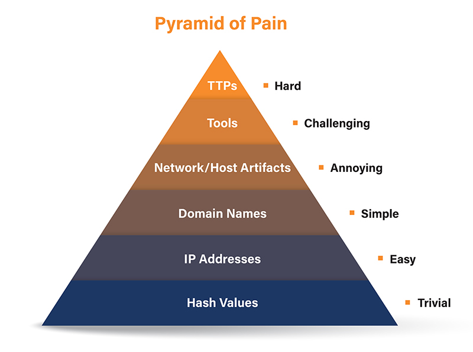

# Pyramid of Pain

## Overview

The Pyramid of Pain is a cybersecurity model created by David Bianco that categorizes Indicators of Compromise (IOCs) based on the level of difficulty an attacker faces when forced to change them. The model helps defenders prioritize detections that have the greatest operational impact on adversaries.

Instead of relying only on easily replaceable indicators such as file hashes or IP addresses, security teams should focus on detecting attacker behaviors and Tactics, Techniques, and Procedures (TTPs), which are significantly harder to modify.

---

## Objectives

After completing this room, I was able to:

- Understand the Pyramid of Pain model.
- Differentiate between various Indicators of Compromise (IOCs).
- Explain why higher-level indicators are more valuable for defenders.
- Understand how Threat Intelligence supports SOC operations.
- Apply the model during threat hunting and incident investigations.

---

# The Pyramid of Pain

The Pyramid of Pain consists of six layers. As defenders move higher in the pyramid, attackers must spend more time, money, and effort to evade detection.

---

## 1. Hash Values

Hashes uniquely identify files using cryptographic algorithms such as MD5, SHA-1, and SHA-256.

### Common Use Cases

- Malware identification
- File integrity verification
- IOC sharing
- Threat intelligence reporting

### Limitation

Hashes are the easiest indicator for attackers to change. Even a minor modification to a file generates a completely different hash value.

---

## 2. IP Addresses

IP addresses identify systems communicating across a network.

### Detection Examples

- Firewall blocking
- Blacklisting malicious infrastructure
- Network monitoring

### Limitation

Attackers can rotate infrastructure, use cloud services, VPNs, or Fast Flux techniques to quickly replace malicious IP addresses.

---

## 3. Domain Names

Domain names are commonly used by attackers for phishing campaigns, malware delivery, and Command-and-Control (C2) communication.

### Detection Examples

- DNS monitoring
- Proxy logs
- Threat Intelligence feeds
- URL reputation services

### Common Attack

- Typosquatting
- Punycode attacks
- URL shortening abuse

---

## 4. Host Artifacts

Host artifacts represent traces left on an endpoint after attacker activity.

Examples include:

- Registry modifications
- Scheduled Tasks
- Dropped files
- Process execution
- Persistence mechanisms
- Event Logs

Host artifacts provide stronger evidence than simple indicators because they reveal attacker activity on compromised systems.

---

## 5. Network Artifacts

Network artifacts are observable characteristics found in network traffic.

Examples include:

- HTTP Headers
- User-Agent strings
- DNS Requests
- HTTP POST Requests
- TLS Fingerprints
- Command-and-Control Traffic

SOC analysts frequently investigate these artifacts using packet captures and SIEM solutions.

---

## 6. Tools

Attackers often reuse malware families, frameworks, scripts, and offensive tools.

Examples include:

- Cobalt Strike
- Mimikatz
- PsExec
- Metasploit
- Empire

Detection methods include:

- YARA Rules
- Sigma Rules
- Fuzzy Hashing
- Antivirus Signatures

Replacing an entire attack toolset requires significant effort from an adversary.

---

## 7. Tactics, Techniques, and Procedures (TTPs)

TTPs represent attacker behavior rather than individual indicators.

Examples include:

- Credential Dumping
- PowerShell Abuse
- Lateral Movement
- Data Exfiltration
- Command and Control
- Defense Evasion

TTP-based detection forces attackers to redesign their operations, making it the most effective detection strategy.

---

# Relationship with MITRE ATT&CK

The Pyramid of Pain closely aligns with the MITRE ATT&CK framework.

MITRE ATT&CK categorizes attacker behaviors into tactics and techniques, enabling defenders to build detections focused on adversary behavior instead of easily replaceable indicators.

Behavior-based detection provides greater long-term value for Security Operations Centers.

---

# SOC Analyst Perspective

From a SOC analyst's perspective, relying solely on low-level indicators such as file hashes or IP addresses is insufficient for effective threat detection.

Modern detection strategies should prioritize behavioral analytics, log correlation, endpoint telemetry, and MITRE ATT&CK mapping to identify malicious activity that attackers cannot easily modify.

This approach increases the operational cost for adversaries while improving detection accuracy.

---

# Key Takeaways

- Not all Indicators of Compromise provide equal defensive value.
- Higher levels of the Pyramid create greater operational challenges for attackers.
- Behavioral detection is more resilient than indicator-based detection.
- Threat Intelligence enhances detection engineering and threat hunting.
- MITRE ATT&CK complements the Pyramid of Pain by focusing on attacker behavior.

---

# Skills Demonstrated

- Threat Intelligence
- IOC Analysis
- MITRE ATT&CK Fundamentals
- Threat Hunting Concepts
- Detection Strategy
- Security Operations (SOC)
- Incident Analysis
- Cyber Threat Analysis
