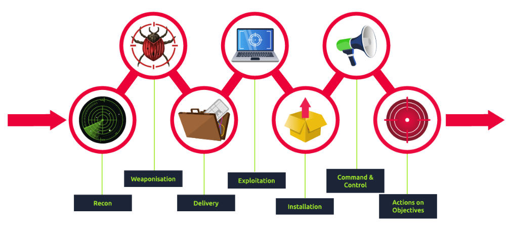

# Unified Kill Chain

> A comprehensive cybersecurity framework developed by **Paul Pols (2017)** that models the complete lifecycle of a cyber attack. It extends the traditional Cyber Kill Chain by integrating concepts from **MITRE ATT&CK** and covering attacker activities from reconnaissance to achieving objectives.

---

## Overview

The **Unified Kill Chain (UKC)** is a modern cyber attack framework designed to help Security Analysts, Threat Hunters, and Incident Responders understand how adversaries conduct attacks.

Unlike the traditional **Cyber Kill Chain**, the UKC models the **entire attack lifecycle**, including:

* Initial Access
* Internal Propagation
* Actions on Objectives

The framework contains **18 attack phases** and complements other industry standards such as **MITRE ATT&CK** rather than replacing them.

---

# Why Unified Kill Chain?

The framework helps defenders to:

* Understand attacker behavior
* Build effective detection strategies
* Improve threat hunting
* Perform incident response
* Strengthen organizational security posture
* Support threat modeling

---

# Threat Modeling

Threat Modeling is the process of identifying security risks before they are exploited.

Typical steps include:

* Identify critical assets
* Discover vulnerabilities
* Assess attack paths
* Implement security controls
* Reduce future risks

Common threat modeling frameworks include:

* STRIDE
* DREAD
* CVSS

---

# Unified Kill Chain Structure

The framework groups attacks into three major goals.

```
Goal In
│
├── Reconnaissance
├── Weaponization
├── Social Engineering
├── Exploitation
├── Persistence
├── Defense Evasion
├── Command & Control
└── Pivoting

↓

Goal Through

├── Pivoting
├── Discovery
├── Privilege Escalation
├── Execution
├── Credential Access
└── Lateral Movement

↓

Goal Out

├── Collection
├── Exfiltration
├── Impact
└── Objectives
```

---

# Goal In (Initial Foothold)

The attacker attempts to gain initial access to the target environment.

## Reconnaissance

Gather information about the target.

Examples:

* OSINT
* Google Dorks
* WHOIS
* LinkedIn
* Social Media
* DNS Enumeration
* Nmap Scanning

---

## Weaponization

Prepare the attack infrastructure.

Examples:

* Malware
* Payloads
* Reverse Shells
* Backdoors
* C2 Infrastructure

---

## Social Engineering

Manipulate users into performing attacker-controlled actions.

Examples:

* Phishing
* Spear Phishing
* Fake Login Pages
* USB Drop Attacks
* Vishing

---

## Exploitation

Execute malicious code by abusing vulnerabilities.

Examples:

* SQL Injection
* Remote Code Execution
* Buffer Overflow
* Known CVEs
* Zero-Day Exploits

---

## Persistence

Maintain long-term access.

Examples:

* Registry Run Keys
* Startup Folder
* Scheduled Tasks
* Windows Services
* Web Shells
* Backdoors

---

## Defense Evasion

Avoid detection by security controls.

Examples:

* Obfuscation
* Log Deletion
* Timestomping
* Process Injection
* Disabling Antivirus

---

## Command & Control (C2)

Establish communication with compromised systems.

Common protocols:

* HTTP
* HTTPS
* DNS
* ICMP

---
.png)
## Pivoting

Use one compromised machine to access additional internal systems.

---

# Goal Through (Network Propagation)

Expand control inside the network.

---

## Discovery

Collect information about the internal environment.

Examples:

* Users
* Groups
* Shares
* Installed Software
* Network Topology

---

## Privilege Escalation

Obtain higher privileges.

Examples:

* SYSTEM
* Administrator
* Root

---

## Execution

Run malicious code on compromised hosts.

Examples:

* PowerShell
* CMD
* Bash
* Scheduled Tasks

---

## Credential Access

Steal authentication credentials.

Examples:

* LSASS Dump
* Mimikatz
* Keylogging
* Credential Dumping

---

## Lateral Movement

Move between internal systems.

Examples:

* PsExec
* SMB
* RDP
* WinRM

---

# Goal Out (Actions on Objectives)

Achieve the attacker's final objective.

---

## Collection

Gather valuable information.

Examples:

* Documents
* Databases
* Browser Data
* Email
* Credentials

---

## Exfiltration

Transfer stolen data outside the organization.

Common methods:

* HTTPS
* DNS Tunneling
* Encrypted Archives
* Compression

---

## Impact

Damage systems or business operations.

Examples:

* Ransomware
* Data Destruction
* Disk Wiping
* Defacement
* Denial of Service

---

## Objectives

The final attacker goal.

Examples:

* Financial Gain
* Espionage
* Data Theft
* Service Disruption
* Reputation Damage

---

# Unified Kill Chain vs Cyber Kill Chain

| Feature                  | Cyber Kill Chain | Unified Kill Chain |
| ------------------------ | ---------------- | ------------------ |
| Release                  | 2011             | 2017               |
| Creator                  | Lockheed Martin  | Paul Pols          |
| Phases                   | 7                | 18                 |
| Covers Internal Movement | ❌                | ✅                  |
| Covers Post-Exploitation | Limited          | Complete           |
| Integrates MITRE ATT&CK  | ❌                | ✅                  |

---

# MITRE ATT&CK Mapping

| Unified Kill Chain Phase             | MITRE ATT&CK Tactic |
| ------------------------------------ | ------------------- |
| Reconnaissance                       | TA0043              |
| Resource Development / Weaponization | TA0042 / TA0001     |
| Initial Access / Social Engineering  | TA0001              |
| Execution / Exploitation             | TA0002              |
| Persistence                          | TA0003              |
| Privilege Escalation                 | TA0004              |
| Defense Evasion                      | TA0005              |
| Credential Access                    | TA0006              |
| Discovery                            | TA0007              |
| Lateral Movement                     | TA0008              |
| Collection                           | TA0009              |
| Exfiltration                         | TA0010              |
| Command & Control                    | TA0011              |
| Impact                               | TA0040              |

---

# Advantages

* Modern attack model
* Covers the complete attack lifecycle
* Supports Threat Hunting
* Improves Incident Response
* Complements MITRE ATT&CK
* Suitable for modern enterprise environments

---

# Limitations

* More complex than traditional Kill Chain
* Requires familiarity with MITRE ATT&CK
* Can be overwhelming for beginners

---

# Key Takeaways

* Unified Kill Chain extends the traditional Cyber Kill Chain.
* It focuses on the complete attacker journey, not just initial compromise.
* Attackers frequently repeat phases such as Discovery, Pivoting, and Privilege Escalation during an intrusion.
* The framework is most effective when combined with MITRE ATT&CK for detection engineering and threat hunting.

---

# Skills Gained

* Threat Modeling
* Threat Hunting
* SOC Analysis
* Incident Response
* Network Propagation Analysis
* Attack Lifecycle Analysis
* MITRE ATT&CK Mapping
* Adversary Emulation

---

> **Platform:** TryHackMe
> **Room:** Unified Kill Chain
> **Category:** SOC Level 1 | Threat Intelligence | Incident Response | Blue Team
